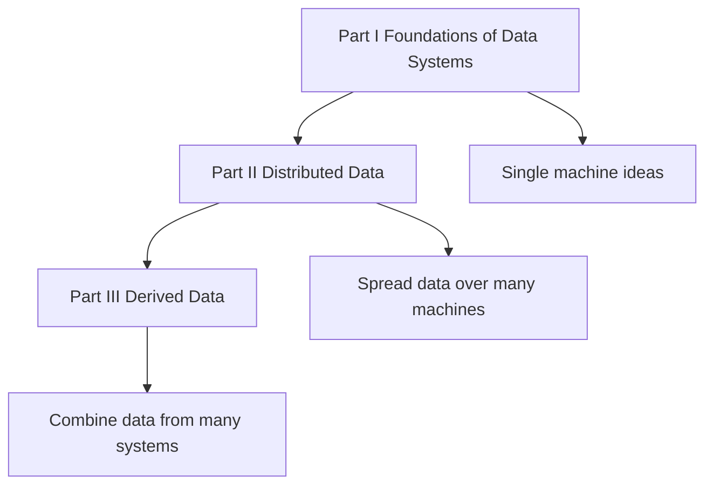
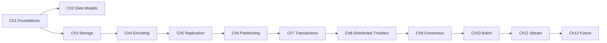

# DDIA Roadmap — The Whole Course at a Glance

This is the map for the entire course. Read the chapters **in order** — each one
assumes the ones before it. The book has three parts; we treat each part as an
**Area**, each chapter as a **Topic**, and teach one laddered lesson per chapter.

> Prev: [[00 - Index and Methodology]] · Hub: [[Home]]

## The shape of the book

The story arc: **Part I** teaches the ideas that hold on one machine. **Part II**
asks what breaks when you spread data across many machines. **Part III** shows how to
build reliable systems *on top of* those messy distributed parts by deriving new data
from old.

## Area 1 — Foundations of Data Systems (Part I)

| # | Topic (chapter lesson) | You will be able to explain… |
|---|------------------------|------------------------------|
| 1 | [[Ch01 - Reliable, Scalable, Maintainable Applications]] | why "reliability, scalability, maintainability" is the scorecard for every system |
| 2 | [[Ch02 - Data Models and Query Languages]] | when to pick relational vs document vs graph, and what "impedance mismatch" means |
| 3 | [[Ch03 - Storage and Retrieval]] | how a database physically stores rows: LSM-trees vs B-trees, OLTP vs OLAP |
| 4 | [[Ch04 - Encoding and Evolution]] | how to change your data format without breaking old and new code |

**Milestone.** You can now explain *what makes an application "data-intensive"* and
reason about the storage engine and data format under any database.

## Area 2 — Distributed Data (Part II)

| # | Topic (chapter lesson) | You will be able to explain… |
|---|------------------------|------------------------------|
| 5 | [[Ch05 - Replication]] | leader/follower, sync vs async, and the dangers of replication lag |
| 6 | [[Ch06 - Partitioning]] | how to shard data by key range or hash, and how to avoid hot spots |
| 7 | [[Ch07 - Transactions]] | what ACID really promises, isolation levels, and the anomalies each one allows |
| 8 | [[Ch08 - The Trouble with Distributed Systems]] | why networks, clocks, and processes lie, and why "partially failed" is the hard case |
| 9 | [[Ch09 - Consistency and Consensus]] | linearizability, the CAP theorem done right, and how consensus (Raft/Paxos) works |

**Milestone.** You can now reason about a system spread over many machines: how it
copies data, splits it, keeps it correct under concurrency, and survives failures.

## Area 3 — Derived Data (Part III)

| # | Topic (chapter lesson) | You will be able to explain… |
|---|------------------------|------------------------------|
| 10 | [[Ch10 - Batch Processing]] | MapReduce, the Unix philosophy, and why immutable inputs make batch jobs safe |
| 11 | [[Ch11 - Stream Processing]] | event streams, log-based message brokers, and processing time vs event time |
| 12 | [[Ch12 - The Future of Data Systems]] | "unbundling" the database and designing systems around dataflow |

**Milestone.** You can now design a pipeline that *derives* new datasets (search
indexes, caches, aggregates) from a source of truth — reliably and repeatably.

## Prerequisite graph (what depends on what)

**A note on order.** Chapters 7 (Transactions) and 8 (Distributed Troubles) lean on
each other: transactions are the *tool* for handling concurrency and faults, while
Chapter 8 explains *why* the faults are so nasty. We teach Transactions first (the
book's order) because its vocabulary — atomicity, isolation — is needed to appreciate
the distributed failures in Chapter 8, and both feed directly into Chapter 9.

## How to study this vault

1. Read [[00 - Index and Methodology]] once (you're past it).
2. Do one chapter lesson per sitting, in number order.
3. Answer the **Check Yourself** questions *before* reading the answers.
4. Follow **Connects To** links when a term feels shaky.
5. Track your progress in the [[Log|Ingestion Log]].

Next: [[Ch01 - Reliable, Scalable, Maintainable Applications]].
