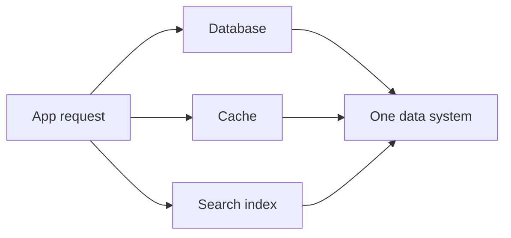
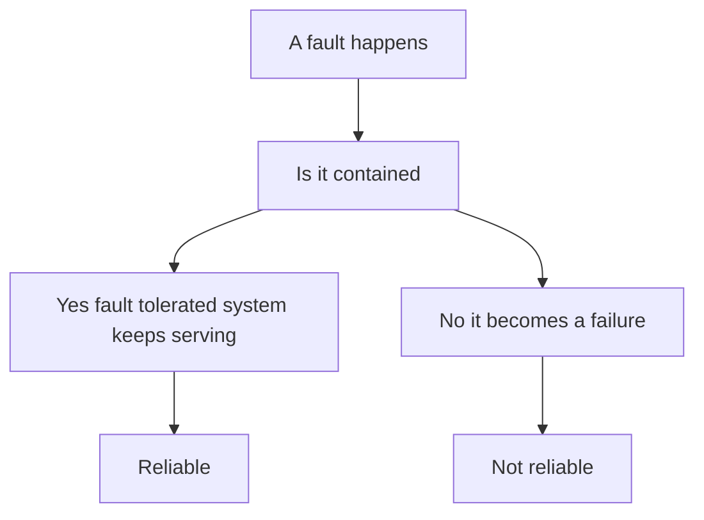

# Reliable, Scalable, and Maintainable Applications

## Recap — Where We Just Were

This is the very first lesson, so there is nothing behind us yet. This whole course walks through how big software stores and moves data, starting from [[01 - Roadmap]]; this chapter sets the three questions every later chapter quietly answers.

## Level 1 — The Big Idea

Some apps are hard because of heavy math. A game rendering 3D graphics burns the CPU (the chip that does calculations). Those are "compute-intensive."

Most apps you use every day are different. They are limited by data: how much there is, how tangled it is, and how fast it changes. DDIA calls these "data-intensive." Think of a photo app, a bank, or a social feed. The hard part is not raw math. The hard part is handling piles of information without losing it, slowing down, or breaking.

We build data-intensive apps out of standard parts: databases (store data), caches (keep a fast copy of things you reuse), search indexes (find things quickly), plus batch and stream processing (crunch data in bulk, or as it flows in). A modern app wires these parts into one "data system."

Analogy: a restaurant kitchen. The fridge is the database. The counter of ready-to-grab ingredients is the cache. The recipe card box is the search index. No single tool matters most; the kitchen works because the parts fit together.

And every data system gets graded on three things: is it Reliable, is it Scalable, is it Maintainable.



## Level 2 — How It Actually Works

Here are the three grades, in plain terms.

Reliability means the system keeps working correctly even when things go wrong. Two words matter. A "fault" is one part misbehaving, straying from its spec (what it is supposed to do). A "failure" is the whole system stopping service to users. The goal is fault-tolerance: keep a fault from turning into a failure. You cannot stop every fault, so you plan for them.

Scalability means coping with growing load. Load is how much work arrives, such as requests per second. More users, more data, more traffic; does the system still hold up?

Maintainability means keeping life easy for the engineers who run and change the system for years. Software is not finished when it ships. People fix bugs, add features, and swap hardware. A system that fights them is a bad one, even if it works today.

New terms glossed: "spec" = the promise a component makes about its behavior. "Load" = the amount of work coming in. "Node" = one machine in a group of machines.



Faults come in three kinds. Hardware faults: disks and machines die. Software faults: a bug that hits many machines at once, which is nastier because it is correlated (one trigger, many victims). Human errors: people misconfigure things, and config mistakes are a leading cause of outages. You fight human error with careful design, sandboxes (safe practice areas), fast rollback (undo a bad change quickly), and monitoring. Netflix runs "Chaos Monkey," a tool that deliberately kills its own servers, to prove the system survives faults.

## Level 3 — See It With Real Numbers

Let's make reliability and performance concrete.

Hardware first. A single disk has a mean-time-to-failure of roughly 10 to 50 years. That sounds safe for one disk. But run a cluster (a group of machines) with 10,000 disks. Spread across that many, you should expect about one dead disk every single day. So big systems assume parts break constantly and add redundancy (spare copies), like a plane with backup engines.

Now performance. We measure it with response time: how long a request takes. The trap is using the average. Averages hide the slow cases. Instead we use percentiles.

A percentile answers "how bad is it for the unlucky?" The p50 (median) is the middle: half of requests are faster. The p99 means 99% are faster and 1% are slower. The p999 is the slowest 1 request in every 1000. These slow ones are "tail latencies."

A real service level agreement (SLA, a written promise about quality) might say: median response time under 200 ms, and p99 under 1 second. Amazon watches p999 closely, because the slowest requests often belong to customers with the most data, who are frequently the most valuable ones.

Here is how you compute percentiles from a list of measured times:

```python
# input: response times in milliseconds
times = [82, 91, 105, 120, 140, 160, 190, 240, 310, 980]

# step 1: sort them fastest to slowest
times.sort()

# step 2: pick the value at the chosen position
def percentile(sorted_times, p):
    index = int(len(sorted_times) * p / 100) - 1
    return sorted_times[index]

# result
print(percentile(times, 50))   # p50 median -> 140
print(percentile(times, 99))   # p99 tail   -> 980
```

The average of that list is about 242 ms, which looks fine. But the p99 is 980 ms. One in a hundred users waits nearly a second. The average lied; the tail told the truth.

Where does the tail come from? Often queueing delay: a slow request holds the line and makes others wait behind it. That is "head-of-line blocking," like one slow shopper stalling a whole checkout lane.

## Level 4 — In the Real World and Common Traps

Named use case: Twitter timelines. When you tweet, followers must see it. When you open your home timeline, you see tweets from everyone you follow. This is called "fan-out."

Approach 1: build your timeline when you read it, by querying everyone you follow right then. Simple, but the read load was brutal, around 300,000 timeline reads per second. That is a lot of work per glance.

Approach 2: fan-out on write. The moment someone tweets, insert that tweet straight into every follower's pre-built timeline, sitting in a cache. Reads get cheap. Writes averaged about 4,600 tweets per second, which is manageable, until a celebrity with 30 million followers tweets once and triggers 30 million writes. Twitter ended up with a hybrid: fan-out on write for normal users, read-time queries for the rare mega-accounts.

Now three misconceptions.

People think scalability is a yes/no label a system "has." Actually it is always about specific load and growth. The right question is "scale along WHICH dimension?" More users? Bigger data? More writes? A system can scale one way and buckle another.

People think average latency tells you the user experience. Actually the tail is what users feel. Use percentiles. Your median can look great while 1% of requests crawl, and those slow moments are exactly what people remember and complain about.

People think you can "just buy a bigger server." Actually that is vertical scaling, and it hits a ceiling: there is a biggest machine money can buy. Going truly large means horizontal scaling, adding many machines in a "shared-nothing" setup (each machine keeps its own data, sharing nothing). That scales far, but adds distributed-systems complexity: now machines must coordinate over a network, and networks are unreliable.

## Level 5 — Expert View

The three concerns protect different things, are measured differently, and each has its own go-to tactic.

| Concern | What it protects | How you measure it | One tactic |
|---|---|---|---|
| Reliability | Correct service under faults | Uptime, faults tolerated | Redundancy and testing |
| Scalability | Performance as load grows | Percentiles at target load | Horizontal shared-nothing |
| Maintainability | Engineers' time over years | Ease of ops and change | Simple abstractions |

Maintainability itself has three parts. Operability: make it easy to run (good monitoring, clear controls). Simplicity: manage complexity with good abstractions, and watch for "accidental complexity," mess that comes from your own design rather than from the problem itself. Evolvability: make the system easy to change as requirements shift.

Trade-offs are real, and these three sometimes fight. Redundancy buys reliability but costs money and hardware. A dead-simple design is easy to maintain but may scale worse than a clever, harder one. Aggressive scaling adds moving parts that hurt both simplicity and reliability. There is no single "correct" system, only sensible choices for a given load, budget, and team. Good engineering is naming which trade-off you are making on purpose, rather than stumbling into one. (This is simplified; the book spends whole later chapters on each tactic.)

## Check Yourself

Memory hook: RSM = the report card of every data system.

**Q:** What is the difference between a fault and a failure?
**A:** A fault is one component straying from its spec; a failure is the whole system stopping service. Fault-tolerance means keeping faults from becoming failures.

**Q:** Why use percentiles like p99 instead of the average response time?
**A:** The average hides slow requests. Percentiles show the tail, the slow cases users actually feel and remember.

**Q:** Why can't you always fix scaling by buying a bigger server?
**A:** That is vertical scaling and it hits a hard ceiling. Growing big means horizontal, shared-nothing scaling across many machines, which adds distributed-systems complexity.

## Connects To

- [[01 - Roadmap]] — where this chapter sits in the whole course.
- [[Home]] — the vault index.
- [[Ch05 - Replication]] — redundancy, a core reliability tactic, in depth.
- [[Ch06 - Partitioning]] — splitting data across machines to scale horizontally.
- [[Ch07 - Transactions]] — keeping data correct when faults strike mid-operation.

## Coming Up Next

[[Ch02 - Data Models and Query Languages]] — now that we know the three grades, we look at how to actually shape and ask questions of the data itself.
