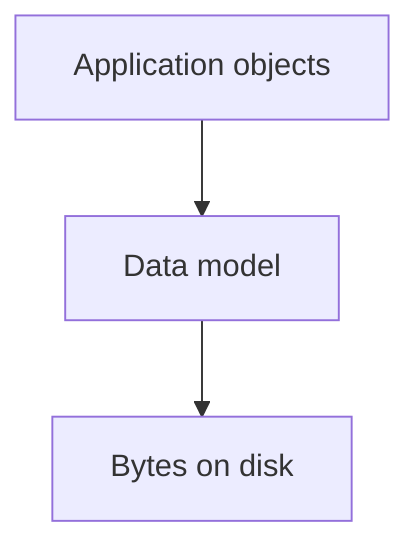
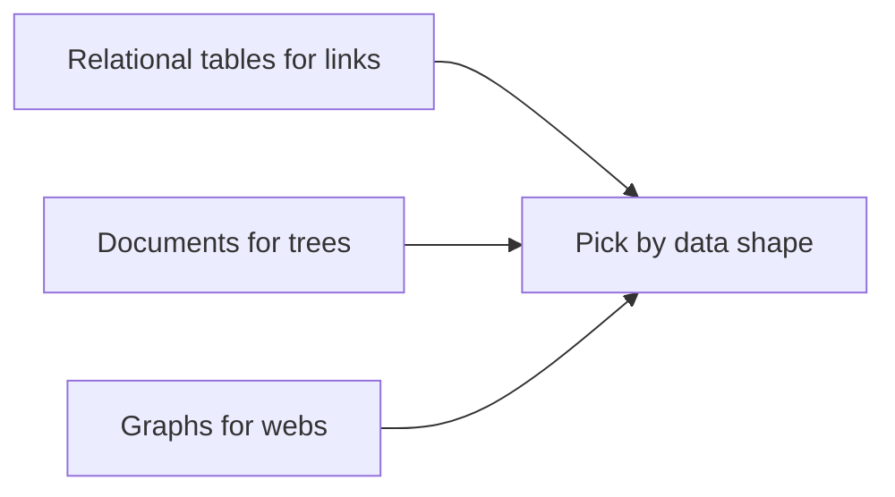

# Data Models and Query Languages

## Recap — Where We Just Were

In [[Ch01 - Reliable, Scalable, Maintainable Applications]] we asked what makes a data system good. The answer had three parts. Reliable means it keeps working when things go wrong. Scalable means it copes as it gets busier. Maintainable means people can keep improving it without pain.

Those are goals. But before you can build anything, you face a more basic choice. How do you shape the data itself? A user, a message, a friendship — what form do they take inside the machine? That shape is called a **data model** (the structure you force your data into). This chapter is about picking one. The choice matters more than it sounds, because the model quietly decides which thoughts about your problem are easy and which are painful.

## Level 1 — The Big Idea

Data is never stored in one form only. It sits in **layers of abstraction** (levels where each one hides the messy details of the level below).

Think of it like a stack. At the top, your program thinks in objects — a "User" with a name and a list of friends. Below that, a data model organises those objects into a general structure. Below that, the structure becomes raw bytes on a disk. Each layer lets you ignore the one under it. You write code about users without worrying about magnetism on a metal platter.

The big idea of this chapter: the middle layer, the data model, is a choice, and it shapes how you can think. Pick tables and you naturally think in rows and links. Pick trees and you naturally think in nested documents. The model does not just store the problem. It frames the problem.



## Level 2 — How It Actually Works

There are three big families of data model. Each fits a different **shape** of data.

**Relational** (the model behind SQL, invented by Edgar Codd in 1970). Data lives in tables. A table is a **relation**, each row is a **tuple** (one record, like one line in a spreadsheet). Tables link to each other by shared IDs. This model is brilliant at **many-to-many relationships** — where many things connect to many other things, like students to classes. It has ruled databases for decades.

**Document** (JSON documents, used by databases like MongoDB and CouchDB). A **JSON document** is a record shaped like a tree — a thing with other things nested inside it. Picture a résumé: one person, containing a list of jobs, containing a list of schools. It is all one self-contained blob. Its superpower is **locality** (the whole document is fetched in a single read, because it is stored together). Great for **one-to-many** tree shapes — one résumé, many jobs.

**Graph** (vertices and edges, used by databases like Neo4j). A **vertex** is a thing. An **edge** is a connection between two things. This model is built for data that is mostly many-to-many and tangled — a social network, or a road map. You query it with special languages: **Cypher** (for property graphs), **SPARQL** (for triple stores), or **Datalog**.

One recurring headache links all this. Your program code uses objects and lists. Relational tables are flat rows. They do not line up. That gap is the **impedance mismatch** (a mismatch between two systems that were not built to fit together). To bridge it, people use an **ORM** (object-relational mapping — a library that translates objects into rows and back). It works, but it is clumsy. The document model reduces this pain for tree-shaped data, because a tree of objects maps cleanly onto a document.



## Level 3 — See It With Real Numbers

Take one résumé. In the document model it is a single tree:

```json
{
  "user_id": 251,
  "name": "Amara",
  "jobs": [
    { "title": "Barista", "years": 2 },
    { "title": "Tutor", "years": 1 }
  ]
}
```

One read fetches the whole thing. Name and both jobs arrive together.

The relational model splits this across tables. It **normalizes** (stores each fact once, in its own place, to avoid repeating it):

```
users               jobs
id | name           user_id | title   | years
251 | Amara         251     | Barista | 2
                    251     | Tutor   | 1
```

Now the two jobs live in a separate table, tied back by `user_id`. To rebuild the résumé you must **join** (match rows from two tables using a shared value):

```sql
-- input: user 251 spread across two tables
SELECT users.name, jobs.title, jobs.years
FROM users
JOIN jobs ON jobs.user_id = users.id
WHERE users.id = 251;

-- steps: find user 251, find its jobs, stitch on user_id
-- result:
-- Amara | Barista | 2
-- Amara | Tutor   | 1
```

The document did the stitching for free by keeping everything together. The relational version needed a join — but that same join machinery is exactly what lets you ask "who else tutored?" across millions of people. Graphs push further; a one-line Cypher query can ask for people born in one region who now live in another:

```
MATCH (p)-[:BORN_IN]->(:Region {name:'North'}),
      (p)-[:LIVES_IN]->(:Region {name:'South'})
RETURN p.name;
```

## Level 4 — In the Real World and Common Traps

Named use case: **LinkedIn**. Your profile is naturally a document — one self-contained tree with your name, jobs, and schools nested inside. Fetch it and the whole page loads in one read. But "people you may know" is naturally a graph — a giant web of many-to-many connections, friends of friends of friends. Same site, two models, because the data has two shapes.

Now the traps.

People think NoSQL means no schema. Actually there is always a schema — it is just an **implicit schema** (assumed by the code that reads the data, not enforced when writing). The structure did not vanish. It moved from the database into your program.

People think document databases are always faster. Actually they are faster only when you grab the whole tree at once. To read one field you still load the **entire** document, and if you need to combine documents, joins are painful and often hand-coded in your app.

People think relational databases cannot store hierarchy. Actually they can, using **foreign keys** (an ID in one table pointing at a row in another) and recursive queries. It is possible — just less convenient than a document tree.

## Level 5 — Expert View

The deepest divide is about **schema** — when structure gets enforced. Relational is **schema-on-write** (the database checks the shape the moment you save, like a strict form that rejects a missing field). Document is **schema-on-read** (structure is only assumed when you read it back, like loose notes you interpret later). Schema-on-read shines when your items are **heterogeneous** (all different) or the structure keeps changing — you just start writing the new shape.

For query languages, the divide is **declarative versus imperative**. **Declarative** (SQL, Cypher) means you say *what* you want and let the engine choose *how* — so it can optimize and run work in parallel for you. **Imperative** means you write the *how*, step by step. Same flavour as CSS (declarative — "make headings blue") versus manually walking the page element by element (imperative). MapReduce querying sits in between the two.

| Model | Best for | Join strength | Schema style | Example system |
|-------|----------|---------------|--------------|----------------|
| Relational | Many-to-many links | Strong, built in | Schema-on-write | PostgreSQL |
| Document | One-to-many trees | Weak, emulate in app | Schema-on-read | MongoDB |
| Graph | Tangled many-to-many webs | Strong for connections | Flexible | Neo4j |

The trade-offs are real and none wins outright. Relational is weak at deeply nested data but strong at joins and many-to-many links. Document is weak at joins and many-to-many but strong at locality for reading a whole tree fast. Graph is built for connections that keep growing in every direction. There is no "best" model — only the one whose natural shape matches your data's natural shape. Choose wrong and you spend your life fighting the model instead of solving the problem.

## Check Yourself

Memory hook: "Shape of the data picks the model: tables for links, trees for documents, webs for graphs."

**Q:** What does schema-on-read mean, and why is "schemaless" misleading?
**A:** The structure is only assumed when you read the data, not enforced when you write it. It is misleading because there is still an implicit schema — the assumptions just live in the reading code instead of the database.

**Q:** Why is the document model good for a résumé but bad for a social network?
**A:** A résumé is one self-contained tree, so locality lets you fetch it in one read. A social network is many-to-many, and documents are weak at joins, so you would have to emulate them awkwardly.

**Q:** What does a declarative query language let the engine do that an imperative one does not?
**A:** Because you state what you want, not how, the engine is free to choose the method — so it can optimize and parallelize the work automatically.

## Connects To

- [[Ch01 - Reliable, Scalable, Maintainable Applications]] — the reliability, scalability, and maintainability goals that any model must serve.
- [[Ch03 - Storage and Retrieval]] — how these models turn into actual bytes on disk.
- [[Ch04 - Encoding and Evolution]] — what happens to schema-on-read when the data's shape changes over time.
- [[01 - Roadmap]] and [[Home]] — where this chapter sits in the whole map.

## Coming Up Next

We picked a data model. But we never asked how the database actually stores and finds the bytes underneath. [[Ch03 - Storage and Retrieval]] opens that layer — the engines, indexes, and structures that make a lookup fast or slow.
