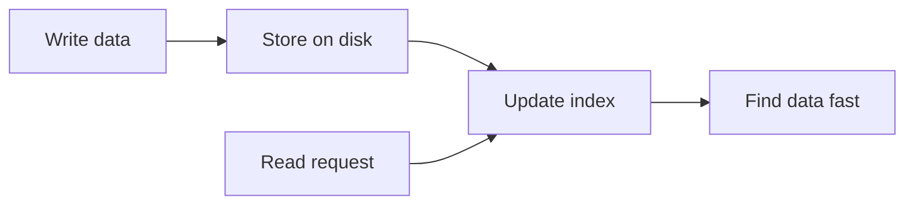
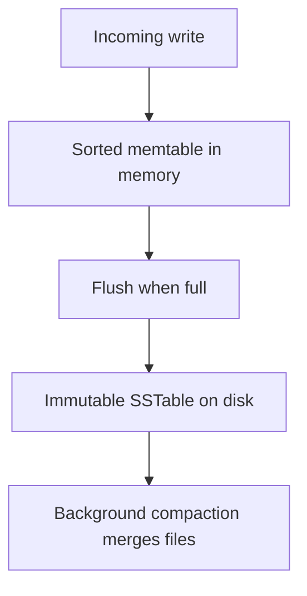
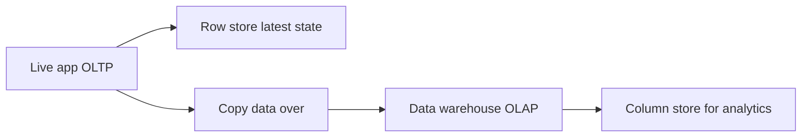

# Storage and Retrieval

## Recap — Where We Just Were

In [[Ch02 - Data Models and Query Languages]] we asked: what *shape* should
your data have? Rows and tables? Nested documents? A graph of connected
things? That chapter was about how you *describe* your data and how you *ask*
for it.

This chapter drops one level down. Now we ask: once the database has your data,
how does it actually put it on the disk, and how does it get it back later
without reading everything? Same data, but now we care about the machinery
underneath.

You do not have to build a database from scratch to care about this. But if you
know how storage engines work, you can pick the right one and understand why it
is fast at some jobs and slow at others.

## Level 1 — The Big Idea

A database has to do two very different jobs.

- **Store:** when you give it data, put it somewhere on disk safely.
- **Retrieve:** when you ask for data later, find it again quickly.

Here is the tension. Storing is easy if you just dump everything in a pile.
Finding it again in a pile is slow, because you have to look through the whole
thing.

The fix is an **index**. An index is an *extra* data structure that the
database keeps on the side to make reads faster. Think of the index at the back
of a textbook. The book itself is the data. The index is a small sorted list
that says "the word photosynthesis is on page 214." You do not flip through 400
pages. You jump straight there.

But indexes are not free. This is the single most important idea in the whole
chapter:

> Every index speeds up reads, but slows down writes. Because when you write
> new data, the database must update the index too.

That trade-off never goes away. It just shows up in different costumes.



## Level 2 — How It Actually Works

Let us meet the three main storage engines. They are just three different
answers to "how do I store and index?"

**1. Hash index (the simplest real one).** Keep your data in a file you only
ever *append* to — you never edit old lines, you just add new ones at the end.
In memory, keep a **hash map**: a lookup table from each key to the exact byte
position (the **offset**) where that key's newest value sits in the file. To
read, look up the offset and jump straight there — one disk seek. This is how a
database called **Bitcask** works.

The problem: the file grows forever, because overwriting a key just appends a
new line and leaves the old one behind. The fix is **segments** and
**compaction**. You break the log into fixed-size chunks called segments. A
background process does compaction: it throws away old overwritten values,
keeps only the latest for each key, and merges segments into smaller ones.

**2. LSM-tree (Log-Structured Merge-tree).** Incoming writes first go into a
sorted structure *in memory* called a **memtable** (often a balanced tree like
a red-black tree, which keeps keys in sorted order). When the memtable gets
big, the database flushes it to disk as a sorted, never-again-edited file
called an **SSTable** (Sorted String Table — sorted by key). Background
compaction merges SSTables together, exactly like the merge step of a
mergesort. Because everything is written as sequential appends, writing is very
fast.

**3. B-tree (the classic).** Instead of logs, break the data into fixed-size
**pages**, usually 4 KB each, arranged as a balanced tree. This is what most
relational databases use. More on it below.



## Level 3 — See It With Real Numbers

Here is the "world's simplest database," straight from the book. Two tiny bash
functions.

```bash
#!/bin/bash
db_set () {
  echo "$1,$2" >> database   # append key,value to the file
}

db_get () {
  grep "^$1," database | sed -e "s/^$1,//" | tail -n 1   # last matching line
}
```

Writing is wonderful. `db_set` just appends one line to the end of the file.
That is about as fast as a computer can write.

Reading is terrible. `db_get` uses `grep` to scan the *entire* file for a
matching key, then takes the last match. If the file has a million lines, it
reads a million lines. That is **O(n)** — the cost grows in a straight line
with how much data you have. Double the data, double the read time. This is
exactly why real databases add indexes.

Now the payoff of a proper index. Take a **B-tree** with a **branching factor**
of about 500 — meaning each 4 KB page holds references to roughly 500 child
pages. Stack it 4 levels deep:

- Level 1: 1 page
- Level 2: 500 pages
- Level 3: 250,000 pages
- Level 4: 125,000,000 pages

With 4 KB of data behind each leaf, a 4-level tree can index around **250 TB**.
And to find *any* single key, you only walk from the top to the bottom — about
**3 to 4 disk seeks**. Not a million. Three or four. That is the difference an
index makes.

## Level 4 — In the Real World and Common Traps

**Named use case.** Two real databases show the split clearly.
**Cassandra** uses LSM-trees and is tuned for workloads with heavy writes —
think logging huge streams of events. **PostgreSQL** and **MySQL** (with its
InnoDB engine) use B-trees and are tuned for reads and transactions — think a
banking app that must read and update accounts reliably.

Three misconceptions worth killing:

- **People think:** an index makes a database faster overall.
  **Actually:** an index speeds up the reads you chose to index, but slows down
  *every* write (the index has to be updated too) and uses extra disk. Faster
  reads are bought with slower writes. Always.

- **People think:** LSM-trees always beat B-trees.
  **Actually:** LSM-trees win on write throughput and compress better, but
  compaction runs in the background and can hurt read *and* write latency at
  awkward moments (a burst of merging steals disk bandwidth). Also a single key
  can exist in several SSTables at once, so a read may check multiple places.

- **People think:** column storage is a whole different kind of database.
  **Actually:** it is just a different *layout* of the same data on the same
  disk. Same rows, arranged differently. (More in Level 6.)

## Level 5 — Expert View

Two details separate the pros from the hand-wavers.

For **LSM-trees**, reads have a hidden cost: a key might not exist at all, and
you would waste disk seeks checking SSTable after SSTable to discover that. The
fix is a **Bloom filter** — a small, clever, probabilistic set. It can tell you
"this key is *definitely not* here" using almost no memory, letting you skip
files entirely. It occasionally says "maybe here" when the key is absent, but
it never wrongly says "not here." So it saves the expensive lookups that were
doomed anyway. Reads also lean on a **sparse index** in memory (one entry every
few kilobytes) plus the fact that SSTables are sorted, so you can scan a small
range quickly.

For **B-trees**, updates happen **in place** — the database overwrites the
actual 4 KB page on disk. That is risky: if the machine crashes halfway through
overwriting a page, the tree could be left broken. So B-trees write a
**write-ahead log** (WAL, also called a redo log) *first*. Every change is
recorded in this append-only log before the real page is touched. After a
crash, the database replays the WAL to fix any half-finished pages.

| | LSM-tree | B-tree |
|---|---|---|
| Write pattern | Sequential appends | Overwrite page in place |
| Read speed | Good, may check several files | Very consistent, 3-4 seeks |
| Write amplification | Lower, sequential | Higher, plus WAL |
| Where a key lives | Possibly in several SSTables | Exactly one page |
| Good for | Write-heavy workloads | Reads and transactions |

Rule of thumb: if your workload is **write-heavy**, lean LSM-tree. If it is
**read-heavy or needs strong transactions**, lean B-tree. Neither is "better" —
they are tuned for different jobs.

## Level 6 — OLTP vs OLAP and Column Stores

So far we assumed one kind of usage. There are really two.

**OLTP (Online Transaction Processing)** is the live app. Many tiny queries,
each touching a few rows by key — "get user 4471's cart," "add one item." It
serves users in real time and cares about the *latest* state. Everything above
(B-trees, LSM-trees) is built for this.

**OLAP (Online Analytical Processing)** is business analytics. A *few* huge
queries, each scanning *millions* of rows to compute a summary — "total sales
per region for every Tuesday last year." These queries are so heavy you do not
run them on the live database. You run them in a **data warehouse**: a separate
copy of the data, kept just for analysts, so their giant queries do not slow
down the app.

Warehouses usually organize data as a **star schema**. In the middle sits one
big **fact table** — one row per event (one row per sale, per click). Around it
sit **dimension tables** describing the who, what, and where (which product,
which store, which date). Draw it and the fact table is a star's center with
dimensions as points.

The real trick is **column-oriented storage**. Normally a database stores all
of *row 1* together, then all of *row 2*. A column store instead keeps all
values of *one column* together — every product-id in one place, every price in
another. Why? An analytics query might need only 3 columns out of 100. Row
storage forces you to read all 100 per row. Column storage reads just the 3 you
asked for. And because a single column is full of similar values, it
**compresses** brilliantly — techniques like **bitmap encoding** and
**run-length encoding** (store "the value 5 repeated 900 times" instead of 900
fives) shrink it dramatically.

| | OLTP | OLAP |
|---|---|---|
| Query size | Many small | Few huge |
| Rows touched | A few, by key | Millions, scanned |
| Layout | Row oriented | Column oriented |
| Example system | PostgreSQL, Cassandra | Data warehouse, column store |

A common columnar file format is **Parquet**, which stores data column by
column and feeds directly into large-scale batch systems — the world we enter
in [[Ch10 - Batch Processing]].



## Check Yourself

**Memory hook:** *LSM writes fast by appending, B-tree reads fast by paging;
rows for the app, columns for the analyst.*

**Q:** Why does adding an index slow down writes?
**A:** Because every time you write data, the database must also update the
index to stay correct. More indexes, more updates per write. The read speedup
is paid for by write cost.

**Q:** In the "world's simplest database," why is reading O(n) while writing is
fast?
**A:** Writing just appends one line to the end of the file — cheap. Reading
greps the whole file for the key, so its cost grows with the file size. That is
why real databases need indexes.

**Q:** For an analytics query that scans millions of rows but needs only a few
columns, why is column storage faster?
**A:** It stores each column's values together, so the query reads only the
columns it needs instead of every column of every row — and those columns
compress extremely well.

## Connects To

- [[Ch02 - Data Models and Query Languages]] — the data *shape*; this chapter
  is the storage *underneath* it.
- [[Ch04 - Encoding and Evolution]] — how the bytes on disk and on the wire are
  actually formatted.
- [[Ch06 - Partitioning]] — once one machine's storage engine fills up, you
  split data across many.
- [[Ch10 - Batch Processing]] — where columnar formats like Parquet get scanned
  at massive scale.
- [[01 - Roadmap]] · [[Home]]

## Coming Up Next

We now know how a database lays bytes on disk. But data also travels — between
program versions, across the network, into files. How do you turn objects into
bytes and back, and keep it working when the schema changes over time? That is
[[Ch04 - Encoding and Evolution]].
