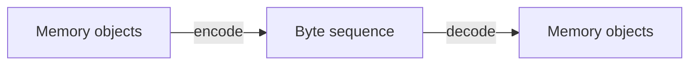
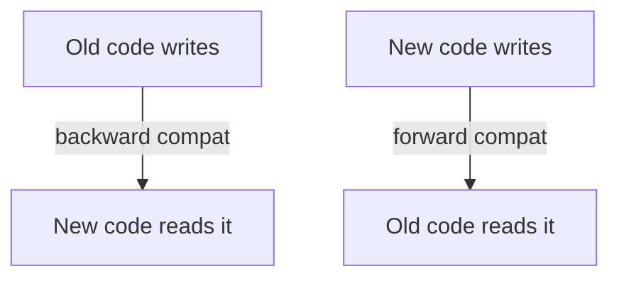

# Encoding and Evolution

## Recap — Where We Just Were

In [[Ch03 - Storage and Retrieval]] we looked at how a database physically keeps your data on disk — log-structured storage with SSTables, or the B-trees under most SQL databases — and how it finds a row again fast.

But notice something. To *store* a row, or to *send* one over the network, the database had to turn your data into bytes on disk. To *use* it in your program, it had to turn those bytes back into objects. This chapter is about that back-and-forth, and about a harder problem: what happens when your code changes but your old data doesn't.

## Level 1 — The Big Idea

Your data lives in two very different forms.

- **In memory**, while your program runs, data is objects, structs, lists, hash tables — shapes optimized for the CPU to poke at quickly.
- **On disk or on the wire**, data has to be a **self-contained byte sequence** — a flat string of bytes that makes sense on its own, with no pointers into your program's memory.

Turning memory into bytes is **encoding** (also called *serialization* or *marshalling* — three words for the exact same thing). Turning bytes back into memory is **decoding** (also called *parsing* or *deserialization*).

That much is old news. The real story is that **applications change over time**. You add a feature, so the data gets a new field. Meanwhile there are years of old data already written, and — during an upgrade — old code still running. The format has to **evolve** without everything breaking.



## Level 2 — How It Actually Works

Here's the situation that makes encoding hard. Say you push new code to your servers. You don't flip all of them at once — that's risky. You do a **rolling upgrade**: new code goes to a few servers at a time. So for a while, **old code and new code run at the same time**, and old-format and new-format data coexist.

That forces you to keep compatibility in *both* directions:

- **Backward compatibility** — new code can read data written by *old* code. Usually easy: you wrote the new code, you know the old format.
- **Forward compatibility** — old code can read data written by *new* code. Trickier — the old code has to **ignore fields it doesn't understand** instead of crashing on them.

("Forward" is the weird one. It means today's code tolerating data from a version that didn't exist when it was written.)



Different encodings handle this very differently:

- **Language-specific formats** (Java `Serializable`, Python `pickle`) are one-line convenient but a bad idea for anything stored long-term or shared — they're tied to one language, carry security risks, version badly, and are inefficient.
- **Textual formats** (JSON, XML, CSV) are human-readable and everywhere. But they're fuzzy about numbers (integer vs float, big numbers lose precision), have no native way to carry binary strings, and only optionally use a schema. Still, "good enough" for a lot of jobs.
- **Binary schema-based formats** (Thrift, Protocol Buffers, Avro) are the serious tools for evolving data at scale — the rest of this chapter.

## Level 3 — See It With Real Numbers

Take a tiny record: a person named Amber with a couple of favourite numbers.

```json
{ "userName": "Amber", "favouriteNumbers": [7, 42] }
```

As JSON that's readable, but every byte spells out the field *names* — `"userName"`, `"favouriteNumbers"` — over and over.

Now the same thing as a **Protocol Buffers** schema. You give every field a numeric **tag**:

```protobuf
message Person {
  required string user_name        = 1;   // field 1
  repeated int32  favourite_numbers = 2;   // field 2
}
```

When Protobuf encodes the record, the bytes reference the **tag number** (1, 2), *not* the field name. The string `"Amber"` still costs its length, but the labels shrink to a single tag byte each. The result is roughly **half the size of the JSON** (illustrative, not a promise — it depends on the data).

Now evolve it. Next month you want to add an email. You add a **new tag number**, and make it optional:

```protobuf
message Person {
  required string user_name        = 1;
  repeated int32  favourite_numbers = 2;
  optional string email            = 3;   // NEW — new tag, optional
}
```

Old code reading new data hits tag 3, doesn't recognize it, and **skips it** — forward compatibility holds. New code reading old data finds no tag 3 and uses the default — backward compatibility holds. The rules that make this work:

- Add a field only with a **new tag number**, and make it optional (or give it a default).
- **Never** reuse or change an existing tag number.
- You may only **remove** a field that was optional.

## Level 4 — In the Real World and Common Traps

**Named use case: a Kafka topic with Avro.** Imagine an events pipeline. Producers encode each event with **Avro** and register the schema in a **schema registry** (a shared service that stores schema versions). Avro is different from Protobuf: there's no tag number. Instead there's a **writer schema** (the schema in force when the data was written) and a **reader schema** (what the consuming code expects now). At read time they're matched **by field name**, and any differences are resolved. That's ideal for huge files and auto-generated schemas — which is exactly Hadoop and Kafka. Services deploy on a rolling basis, so schemas evolve while the pipeline keeps running, no downtime.

Three things people believe that aren't true:

- **People think:** "Just add a `NOT NULL` column or a required field and redeploy." **Actually:** that breaks forward compatibility. Old code, still running mid-rollout, writes rows *missing* the new field; new code then chokes because the field it demands isn't there. New fields must be **optional or defaulted**.
- **People think:** "REST and RPC are basically like calling a local function." **Actually:** the network changes everything. A remote call can be slow, time out, or fail halfway. So retries happen, which means **idempotency** (safe to run twice) matters. A local function never had to worry about that.
- **People think:** "JSON has no schema, so there's nothing to evolve." **Actually:** there's always an *implicit* schema — the shape your readers expect. Change it carelessly and you still break them; the schema just isn't written down.

## Level 5 — Expert View

Once data is encoded, it moves between processes in three **modes of dataflow**:

1. **Through databases** — the writer and reader can be different processes at different *times*. New code writes, old code reads, and vice versa. Data often **outlives the code** that wrote it, so schemas must evolve gracefully.
2. **Through services** — **REST** (built on HTTP, with resources and verbs) and **RPC** (Remote Procedure Call, which *tries* to make a network call look like a local one — e.g. gRPC). Remember the warning above: a network call is not a local call.
3. **Through asynchronous message passing** — a **message broker** (RabbitMQ, Kafka) sits between sender and receiver, buffering messages. It decouples the two — the sender doesn't wait for the receiver — and leads straight into [[Ch11 - Stream Processing]].

Here's how the three encoding families stack up:

| Property | JSON / XML | Thrift / Protobuf | Avro |
|---|---|---|---|
| Human readable | Yes | No | No |
| Size | Largest | Compact | Compact |
| Needs a schema | Optional | Yes (with tags) | Yes (writer + reader) |
| Compatibility via | Implicit, manual | Tag numbers | Field-name matching |
| Best use | Debugging, open APIs | Evolving high-volume services | Big files, dynamic schemas, Kafka |

**The trade-off:** text (JSON) wins for debugging, openness, and "just eyeball it." Binary schema formats win for large-scale, high-volume, constantly-evolving pipelines where every byte and every safe upgrade counts. There's no universal winner — you pick based on whether a human or a machine is the main reader.

## Check Yourself

**Memory hook:** *"Encode small, evolve safely: new fields optional, old fields never reused."*

**Q:** What's the difference between backward and forward compatibility?
**A:** Backward = new code can read *old* data. Forward = old code can read *new* data (it must ignore fields it doesn't know).

**Q:** In Protobuf, why can you add a field but never reuse an old tag number?
**A:** The bytes reference tag numbers, not names. Reusing a tag would make old data decode into the wrong field. A new optional tag is simply skipped by old readers, so both directions stay safe.

**Q:** How does Avro match a writer's data to a reader's expectations without tag numbers?
**A:** It keeps a writer schema and a reader schema and matches fields **by name** at read time, resolving any differences (fields with defaults can be added or removed).

## Connects To

- [[Ch03 - Storage and Retrieval]] — how those bytes actually land on disk.
- [[Ch11 - Stream Processing]] — where message brokers and evolving event schemas grow up.
- [[01 - Roadmap]] · [[Home]] — the map of this vault.

## Coming Up Next

Encoding got one copy of your data safely onto disk or across the wire. But real systems keep **many** copies, on many machines, so data survives a failure and reads stay fast. Keeping those copies in sync is its own hard problem — next in [[Ch05 - Replication]].
