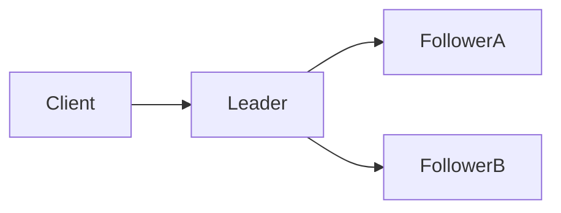
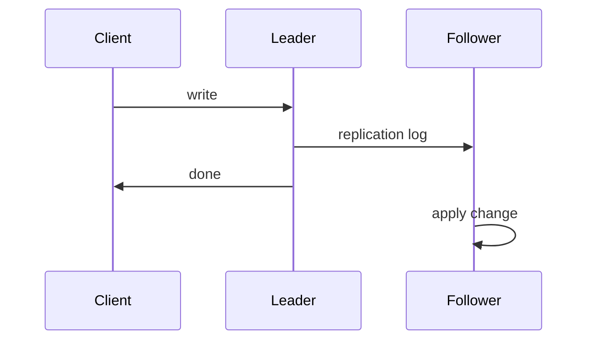

# Replication

## Recap — Where We Just Were

In [[Ch04 - Encoding and Evolution]] we worked out how to turn data in memory
into bytes that can travel across a network or sit on disk, and how to keep old
and new versions of your code talking to each other (that's "evolution" — the
schema changes but nothing breaks).

That chapter was about *one* copy of the data changing shape over time. Now we
ask a bigger question: what if you keep the *same* data on several machines at
once? Each machine still encodes and decodes bytes the same way — but now they
have to agree with each other. That agreement is the whole story of this chapter.

## Level 1 — The Big Idea

**Replication** means keeping a copy of the same data on multiple machines
(we call each machine a *node*). Why bother?

- **Lower latency** — put a copy near your users. (Latency = the wait before you
  get an answer. A copy in Tokyo answers Tokyo faster than one in New York.)
- **Higher availability** — if one node dies, another keeps serving.
- **Higher read throughput** — many nodes can answer read requests at once.
  (Throughput = how much work per second.)

Here's the twist that makes replication hard: copying data that never changes is
trivial — just paste it. The real problem is handling **changes**. Every time
someone writes new data, every copy has to find out. Do it wrong and your copies
disagree, and disagreeing copies quietly hand people the wrong answers.



## Level 2 — How It Actually Works

The most common design is **single-leader replication** (older names:
master-slave, primary-replica). One node is chosen as the **leader**. Every
**write** must go to the leader. The leader saves the change to its own storage,
then ships that change to the **followers** through a **replication log** — an
ordered list of "here's what changed." **Reads** can go to any replica, leader or
follower. PostgreSQL, MySQL, and MongoDB replica sets all work this way.

One key choice: does the leader **wait** for followers?

- **Synchronous** — the leader waits for a follower to confirm before it tells
  the client "done." Safe (that follower definitely has the data) but slow, and
  if that follower stalls, every write stalls with it.
- **Asynchronous** — the leader does not wait. Fast, but if the leader crashes
  before a change reaches the followers, those writes are simply **lost**.
- **Semi-synchronous** — a practical middle ground: exactly one follower is
  synchronous, the rest are async.

**Adding a new follower:** you don't copy a moving target. You take a consistent
**snapshot** of the leader, copy it over, then let the follower **catch up** on
every change since that snapshot's position in the log.



## Level 3 — See It With Real Numbers

Single-leader has one leader; **leaderless replication** (the Dynamo style, used
by Amazon Dynamo, Cassandra, Riak) has none. The client sends each write to
*several* replicas and reads from *several* too. To know when you've read fresh
data, you use a **quorum** — a required minimum number of nodes.

The rule with `n` replicas, `w` write-nodes, and `r` read-nodes:

```text
n = total replicas
w = nodes that must confirm a write
r = nodes queried for a read

quorum is safe when:   w + r > n

classic Dynamo setup:  n = 3, w = 2, r = 2
check:                 2 + 2 = 4 > 3   -> OK
```

Why does `w + r > n` help? If writes land on 2 of 3 nodes and reads ask 2 of 3,
the two sets *must* overlap by at least one node — and that shared node saw the
latest write. So your read catches fresh data.

| n | w | r | w + r | overlaps? |
|---|---|---|-------|-----------|
| 3 | 2 | 2 | 4     | yes       |
| 3 | 3 | 1 | 4     | yes (fast reads, slow writes) |
| 3 | 1 | 1 | 2     | no — can miss the latest write |
| 5 | 3 | 3 | 6     | yes       |

To fix replicas that fell behind, Dynamo systems use **read repair** (spot a
stale value during a read and correct it) and **anti-entropy** (a slow
background process that syncs replicas). Both push the copies toward agreement.

## Level 4 — In the Real World and Common Traps

**Named use case:** PostgreSQL streaming replication — a single async leader
feeding several read replicas for a busy web app. The leader takes all writes;
the read replicas absorb the flood of reads (product pages, searches) so the
leader isn't crushed. Cassandra is the leaderless counterpart, doing quorum
reads and writes across a cluster.

Traps people fall into:

- **People think:** replication automatically makes every read up to date.
  **Actually:** with async replication, followers **lag** behind the leader, so
  you can read **stale** (old) data. This is called **eventual consistency** —
  followers catch up *eventually*, but "now" they may be behind.
- **People think:** more replicas is always better. **Actually:** every extra
  copy costs write bandwidth, and in multi-leader or leaderless setups more
  copies mean more **conflicts** to resolve.
- **People think:** a quorum guarantees you always read the newest value.
  **Actually:** edge cases and "sloppy quorums" (see below) can still hand back
  stale data.

Replication lag causes real bugs, so DDIA names three guarantees to fix them:

1. **Read-your-own-writes** — a user who just posted must see their own post.
   Fix: read their *own* recent writes from the leader, not a lagging follower.
2. **Monotonic reads** — never show a user data that jumps **backward** in time.
   That happens if two reads hit two followers with different lag. Fix: pin each
   user to one replica.
3. **Consistent prefix reads** — writes must be seen in causal order, so a reply
   never shows up before the message it answers.

**Failover is where things go wrong.** A crashed *follower* just does
**catch-up recovery** from its last log position — easy. A crashed *leader*
needs **failover**: detect it's gone (usually a timeout), pick a new leader
(often the most up-to-date follower), and reroute writes. This is dangerous:
with async replication the new leader may be **missing recent writes**;
**split brain** is when two nodes both think they're leader; and timeouts are
brutally hard to tune. Real incident: GitHub once promoted a MySQL follower that
had fallen behind, so it reused primary keys and handed some rows to the wrong
users.

## Level 5 — Expert View

When one leader isn't enough, **multi-leader replication** lets more than one
node accept writes — one leader per datacenter, or offline apps like calendars,
or collaborative editors like a shared doc. Writes stay local and available. The
price: **write conflicts** when two leaders change the same thing at once. You
resolve them with last-write-wins (simple, but it *loses* data), version
tracking, application-specific merge functions, or **CRDTs**
(conflict-free replicated data types — data structures built to merge cleanly).

| | Single-leader | Multi-leader | Leaderless |
|---|---|---|---|
| Who accepts writes | one node | several leaders | any/several replicas |
| Conflict risk | none | high | possible |
| Availability on partition | leader side only | high | high |
| Example system | PostgreSQL | multi-datacenter setups | Cassandra |

**Trade-offs:** single-leader is the simplest and avoids conflicts entirely, but
the leader is a bottleneck and a single point that must fail over. Multi-leader
and leaderless trade some consistency for availability and write locality — you
stay writable during a network partition, but you must handle conflicts or stale
reads. Note **sloppy quorums** and **hinted handoff**: they keep writes flowing
during a partition by accepting them on any reachable node, which keeps you
available but weakens the "you'll read fresh" promise.

## Check Yourself

**Memory hook:** *"One leader is simple but fragile, many leaders are available
but fight; quorums split the difference with w plus r greater than n."*

**Q:** Why is copying replicated data easy but replication hard?
**A:** Storing static copies is trivial — the hard part is propagating every
**change** so the copies stay in agreement.

**Q:** In a leaderless system with n=3, why does w=2, r=2 give fresh reads?
**A:** Because w + r = 4 > 3, so the write set and read set must overlap by at
least one node, and that node saw the latest write.

**Q:** What is read-your-own-writes consistency and how do you get it?
**A:** A user must see data they just wrote. You get it by reading their own
recent writes from the leader instead of a possibly-lagging follower.

## Connects To

- [[Ch04 - Encoding and Evolution]] — each replica encodes/decodes changes;
  the replication log is those encoded changes in transit.
- [[Ch06 - Partitioning]] — replication copies data; partitioning splits it.
  Real systems do both at once.
- [[Ch07 - Transactions]] — what "done" and "consistent" really mean per write.
- [[Ch09 - Consistency and Consensus]] — leader election, split brain, and the
  hard guarantees behind safe failover.
- [[01 - Roadmap]] · [[Home]]

## Coming Up Next

Replication keeps *whole copies* of the data. But what if the data is too big to
fit on one machine at all? Then you slice it into pieces and spread the pieces
around. That's **partitioning** — and it pairs with everything here. Continue to
[[Ch06 - Partitioning]].
