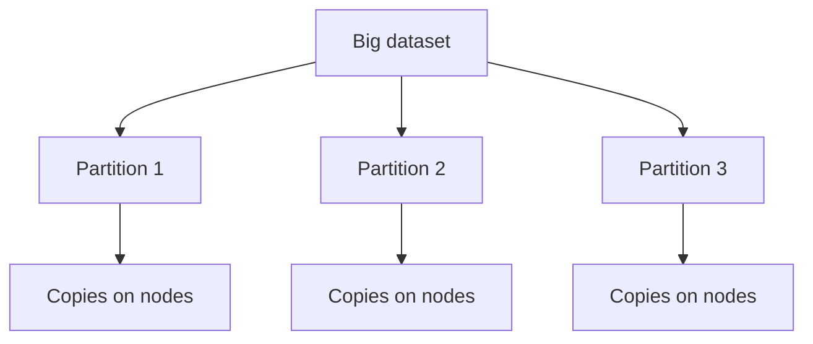

# Partitioning

## Recap — Where We Just Were

In [[Ch05 - Replication]] we made **copies** of the same data on several machines. Copies buy you two things: if one machine dies, another still has the data (fault tolerance), and reads can be spread across the copies. But replication has a ceiling. Every copy holds the *whole* dataset. If your data grows past what one machine can store, copying it more times does not help — every node is still choking on the same giant pile.

So we need a different move. Instead of copying the whole thing, we **cut it into pieces** and give each machine a different piece. That is this chapter.

Keep both ideas in your head at once, because real systems use them together.

## Level 1 — The Big Idea

**Partitioning** (also called **sharding**) means splitting one big dataset into pieces called **partitions**. Each record lives in exactly one partition — no record is in two places. That way no single machine has to hold or serve everything.

Think of a huge encyclopedia. One person cannot carry all 26 volumes. So you hand volume A to one friend, volume B to another, and so on. Now the load is shared. That is partitioning.

Here is the key relationship with last chapter: **partitioning and replication are orthogonal** — a fancy word for *independent*. You split the data into partitions, and then you *also* copy each partition to several nodes (that is the replication from [[Ch05 - Replication]]). So each machine holds a few partitions, and each partition exists on a few machines. Splitting handles *size*; copying handles *failure*.



The whole point: scale **beyond one machine**.

## Level 2 — How It Actually Works

The big question is: *which record goes in which partition?* For key-value data there are two main answers.

**By key range.** Give each partition a continuous range of keys, like the encyclopedia volumes (A–C, D–F, G–I…). Inside a partition the keys stay **sorted**. That makes **range scans** cheap — "give me everything from Monday to Friday" is one clean sweep. The danger: if your key is something like a timestamp, then *all* of today's writes land on the *same* partition. One partition sweats while the rest nap.

**By hash of key.** Run each key through a **hash function** — a blender that turns any key into a scrambled-looking number — and use that number to pick the partition. This **spreads load evenly**, so no timestamp hot spot. The cost: it **destroys range queries**. Two keys that were neighbours (Monday and Tuesday) get blended into totally different numbers and fly off to different partitions. There is no "next-door" anymore.

A **hot spot** is a partition doing far more work than the others. A partition that is unfairly loaded is called **skewed**. Hot spots waste your cluster — you paid for ten machines and one is drowning while nine idle.


## Level 3 — See It With Real Numbers

Say you decide up front to have **256 partitions** and you run them on **4 nodes**. Then each node holds `256 / 4 = 64` partitions. Nice and even. Add nodes later and you just hand some partitions over.

To place a key, you hash it and take the remainder against the **number of partitions**:

```python
num_partitions = 256          # FIXED once, up front — not the node count

def which_partition(key):
    return hash(key) % num_partitions   # e.g. 0..255

# a partition-to-node map (kept elsewhere) says which node owns partition N
```

The word **FIXED** is the whole trick. `num_partitions` never changes, so a key always maps to the same partition, no matter how many machines you own.

Now the **broken** version people reach for first:

```python
# DO NOT do this
def which_node(key, num_nodes):
    return hash(key) % num_nodes    # tied to machine count — bad
```

Watch what breaks. With 4 nodes, `hash(key) % 4`. Add one machine → `hash(key) % 5`. Almost *every* key now computes a different node, so almost *all* your data has to move at once. That is a data-shuffling nightmare. Hashing to a fixed partition count avoids it, because the partition number never moves — only which node *owns* that partition changes.

## Level 4 — In the Real World and Common Traps

Real example: **Elasticsearch** and **MongoDB** sharding. Your data is split into shards (partitions), and each shard is replicated for safety — partitioning and replication working together, exactly as promised. HBase and Bigtable-style stores use key-range partitioning; Cassandra and Riak lean on hashing.

**People think X. Actually Y.**

- **People think** hash partitioning still lets you do range scans. **Actually** hashing scatters neighbouring keys across partitions, so a range scan is gone. Cassandra's fix is a **compound key**: hash the *first* part to choose the partition, keep the *rest* sorted inside it. Now you get even spread *and* range scans within one partition.
- **People think** rebalancing should be fully automatic. **Actually** automatic rebalancing plus a *wrong* guess that a node failed can move huge amounts of data at the worst moment and overload the cluster — a cascade. Keep a human in the loop.
- **People think** partitioning and replication are the same thing. **Actually** partitioning splits data into *different* pieces; replication copies the *same* piece. Real systems do both.

One more trap: even perfect hashing cannot save you from a single **super-hot key** — say a celebrity's user id getting a flood of activity. Hashing spreads *different* keys, but this is *one* key. The fix is at the application level: split that one key into, say, 100 sub-keys by adding a random suffix, then combine them back on read.

**Secondary indexes** add a wrinkle. A secondary index lets you search by a field that is *not* the key (like "all red cars").
- **Local (document-partitioned) index:** each partition indexes only its own data. Writes are cheap, but a search must ask **every** partition and merge the answers — called **scatter/gather**. Cheap writes, expensive reads.
- **Global (term-partitioned) index:** the index itself is partitioned by the indexed term. A read hits one partition, but a single write may touch several partitions. Cheap reads, expensive writes.

## Level 5 — Expert View

**Rebalancing** is moving partitions between nodes when you add or remove machines. Good strategies:
- **Fixed number of partitions:** make many more partitions than nodes up front (e.g. 1000), assign several per node. To add a node, just move whole partitions to it. Used by Riak and Elasticsearch.
- **Dynamic partitioning:** split a partition when it grows too big, merge when it shrinks. Used by HBase.

And **request routing**: when a client wants a key, *which node has it?* This is a form of service discovery. Options: let any node forward the request, use a routing tier, or make the client partition-aware. Many systems track the partition-to-node map in a coordination service like **ZooKeeper**; **Cassandra** uses a **gossip** protocol instead.

| Aspect | Range partitioning | Hash partitioning |
|---|---|---|
| Range scans | Efficient (keys sorted) | Broken (keys scattered) |
| Hot-spot risk | High (e.g. timestamps) | Low (spread evenly) |
| Example | HBase, Bigtable | Cassandra, Riak |

**The trade-off:** range partitioning wins when your dominant query is a scan; hash partitioning wins when you need even load. You do not get both for free — pick based on how your app actually queries. Cassandra's compound-key trick is the negotiated middle.

## Check Yourself

**Memory hook:** *Range keeps order but risks hot spots; hash spreads the load but kills the range scan.*

**Q:** Why is `hash(key) % num_nodes` a bad way to place data?
**A:** The moment you change the number of nodes, almost every key maps to a different node, so nearly all the data has to move at once. Hash to a *fixed* partition count instead.

**Q:** You need fast "last 24 hours" queries. Range or hash partitioning?
**A:** Range — it keeps keys sorted so a time window is one clean scan. (But watch for the timestamp hot spot on writes.)

**Q:** What is the difference between a local and a global secondary index?
**A:** Local indexes only its own partition, so writes are cheap but reads must scatter/gather across all partitions. Global partitions the index by term, so reads hit one partition but writes may touch several.

## Connects To

- [[Ch05 - Replication]] — the copies that ride *alongside* partitioning; the two are orthogonal.
- [[Ch03 - Storage and Retrieval]] — sorted storage inside a single partition is what makes range scans cheap.
- [[01 - Roadmap]] and [[Home]] — where this chapter sits in the whole book.

## Coming Up Next

We can now spread data across many machines. But once a single action touches *several* partitions or nodes, what happens if one part succeeds and another fails halfway? That messy, all-or-nothing question is the subject of [[Ch07 - Transactions]].
