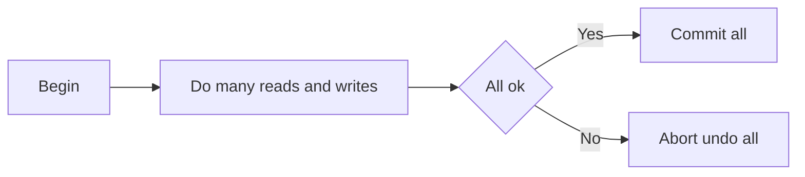
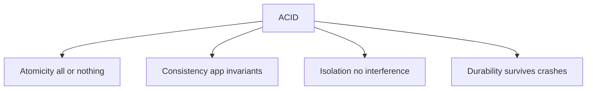

# Transactions

## Recap — Where We Just Were

In [[Ch06 - Partitioning]] we chopped a huge dataset into pieces (partitions) so
it could live on many machines. That made reads and writes fast and scalable.
But it also raised a scary question: when lots of things happen at once, and
machines can crash halfway through, how do you keep the data from turning into
garbage?

Think about it. A disk can die mid-write. The network can drop. Two users can
click "buy" on the same seat at the same millisecond. If every application
programmer had to hand-write code for every possible half-finished mess, nobody
would ever ship anything. This chapter is about the tool that hides that mess:
the **transaction**.

## Level 1 — The Big Idea

A **transaction** is a way to group several reads and writes into ONE logical
unit. The deal is simple: either the whole group succeeds (**COMMIT**), or the
whole group fails and every change is undone (**ABORT**, also called ROLLBACK).
There is no in-between.

Its real purpose is to **simplify error handling**. Without transactions, if
step 3 of 5 fails, your app has to figure out what steps 1 and 2 already did and
carefully unwind them. With a transaction, you don't reason about partial
states at all. It either all happened or none of it did. If it aborted, you just
**retry**.



That all-or-nothing promise is one letter of a famous four-letter word: **ACID**.

## Level 2 — How It Actually Works

ACID stands for four promises. They sound like one idea but they're really four
separate ones, and one of them is a bit of a fraud.

- **A — Atomicity.** All-or-nothing. If anything in the transaction fails,
  every change already made gets undone. Kleppmann says this is really better
  named "abortability" — it's about the ability to throw everything away
  cleanly, not about "atoms" being indivisible.
- **C — Consistency.** The database moves from one valid state to another,
  obeying the application's rules (called **invariants** — things that must
  always be true, like "account balances never go negative"). But here's the
  catch: keeping those rules true is really the **application's** job, not the
  database's. The database can't know what "valid" means for your app. So C is
  the odd letter out — it snuck into the acronym mostly because ACID spells a
  nice word.
- **I — Isolation.** Transactions running at the same time don't step on each
  other. The gold standard is **serializability**: the result looks as if the
  transactions ran one at a time, in some order, even though they actually
  overlapped.
- **D — Durability.** Once you commit, the data survives crashes. This is done
  with a **write-ahead log** (writes are recorded to disk before they're
  applied, so a crash can be replayed) and replication ([[Ch05 - Replication]]).



You may hear people say their database is "BASE" instead of ACID. Honestly, BASE
is a vague marketing term — a fuzzy opposite of ACID rather than a precise
promise. Don't read too much into it.

## Level 3 — See It With Real Numbers

Real serializable isolation is expensive, so databases often run at weaker
levels — which lets some races through. The classic race is the **lost update**.

Imagine a counter starting at **100**. Two transactions each want to add 1. Both
read 100. Both compute 101. Both write 101. The final value is **101** — but it
should be **102**. One increment vanished.

Here's the unsafe pattern each of them runs:

```sql
BEGIN;
SELECT value FROM counters WHERE id = 1;   -- both read 100
-- app computes 100 + 1 = 101
UPDATE counters SET value = 101 WHERE id = 1;  -- both write 101
COMMIT;
```

Read-modify-write, done twice at once, loses data. The fix is to never read the
value into your app at all. Let the database do the math atomically:

```sql
BEGIN;
UPDATE counters SET value = value + 1 WHERE id = 1;  -- safe
COMMIT;
```

Now the database applies `+ 1` to whatever the current value is, one at a time.
Two runs give **102**, correctly. Other fixes: an explicit lock
(`SELECT ... FOR UPDATE`, which says "nobody touch this row until I'm done"), or
letting the database automatically detect the conflict and abort the loser.

And **snapshot isolation** (next section) gives a different guarantee: a
transaction that just *reads* the counter keeps seeing a stable **100** the whole
time, even while others bump it to 101, 102, 103. Its view is frozen.

## Level 4 — In the Real World and Common Traps

**Use case: a bank transfer.** Move $100 from Alice to Bob. That's two writes:
subtract from Alice, add to Bob. If only one happens, money either vanishes or
gets duplicated. Wrapping both in a transaction makes it atomic — the money is
always somewhere, never nowhere and never in two places.

**Use case: seat booking.** Two people try to reserve the last seat. Without
proper isolation you get a **write skew** (explained below) and the seat is
double-booked. Airlines and cinemas care a lot about this.

Some things people believe that aren't quite right:

- **People think:** "ACID means my data is always correct." **Actually:** the C
  (consistency) is *your* responsibility. The database enforces atomicity,
  isolation, and durability; it can't know your app's rules. Buggy app logic
  still corrupts data inside a perfect transaction.
- **People think:** "Repeatable Read means the same thing everywhere."
  **Actually:** vendors disagree wildly. Oracle even calls its snapshot
  isolation "SERIALIZABLE," and the SQL standard's isolation-level names are
  famously muddled. The label on the box doesn't tell you what you actually get.
- **People think:** "Serializable isolation is too slow to ever use."
  **Actually:** that was true for decades, but modern **Serializable Snapshot
  Isolation** (below) changed the math. It's now practical.

Two more anomalies weak isolation allows, beyond lost update:

- **Write skew.** Two transactions read the same data, then each writes to a
  *different* row, and together they break a rule. Classic example: two doctors
  are on call. Each transaction checks "is at least one *other* doctor on call?"
  — sees yes — and lets its doctor go off call. Both commit. Now **nobody** is
  on call. Each write was fine alone; together they broke the invariant.
- **Phantoms.** A write in one transaction changes the *result of a search
  query* running in another. (In the doctor case, the search "how many doctors
  are on call?" is the thing whose answer got changed underneath.)

## Level 5 — Expert View

Weaker isolation levels are a menu of trade-offs. Each one blocks some races and
allows others. Here's the cheat sheet:

| Isolation level | Stops dirty reads and dirty writes | Stops lost update | Stops write skew and phantoms |
|---|---|---|---|
| Read Committed | Yes | No | No |
| Snapshot Isolation | Yes | Partly (not automatically) | No |
| Serializable | Yes | Yes | Yes |

A few definitions for that table:

- A **dirty read** is seeing another transaction's *uncommitted* write (data
  that might still get rolled back). A **dirty write** is *overwriting* another
  transaction's uncommitted write. **Read Committed** — the common default —
  blocks both.
- **Snapshot Isolation** (often sold as "Repeatable Read") gives each
  transaction a **consistent snapshot**: a frozen picture of the whole database
  as of when it started. A long-running read isn't disturbed by concurrent
  writes. It's implemented with **MVCC** (Multi-Version Concurrency Control):
  the database keeps several versions of each row, tagged by transaction id, and
  shows you only the versions committed before you began. This prevents **read
  skew** (aka nonrepeatable reads) and is perfect for backups and analytics,
  where you want a stable picture.

The trade-off in one sentence: **stronger isolation = fewer bugs, but more
overhead and more aborts.** Serializable is safest and slowest; Read Committed
is fastest and leakiest. You pick based on how much correctness pain you can
tolerate.

## Level 6 — The Three Ways to Get Serializability

Serializability is the *only* level that cures **all** the races — dirty reads,
lost updates, write skew, phantoms, everything. There are exactly three known
ways to actually achieve it:

| Technique | Idea | Used by | Watch out for |
|---|---|---|---|
| Actual Serial Execution | Run transactions one at a time on a single thread | VoltDB, Redis | Needs short transactions and data that fits in memory; leans on stored procedures and partitioning |
| Two-Phase Locking (2PL) | Writers take exclusive locks, readers take shared locks; predicate and index-range locks kill phantoms | Many traditional databases | Slow, deadlocks, ugly tail latency |
| Serializable Snapshot Isolation (SSI) | Run optimistically on a snapshot, then at commit check if anything you read changed; if so abort the loser and retry | PostgreSQL 9.1+, FoundationDB | Aborts pile up under high contention |

1. **Actual Serial Execution.** Just... don't run them concurrently. One thread,
   one transaction at a time. Sounds crazy slow, but if transactions are short
   and everything fits in RAM, a single core is fast enough — and you delete a
   whole category of bugs.
2. **Two-Phase Locking (2PL).** The old-school pessimistic way. Before touching
   data you must grab a lock. Readers share; writers get exclusive access.
   Special **predicate/index-range locks** stop phantoms by locking not just
   rows that exist but the *conditions* of a search. It's correct — and slow,
   with deadlocks and bad worst-case latency.
3. **Serializable Snapshot Isolation (SSI).** The modern **optimistic** way. Let
   transactions run freely on their snapshots, assume the best, and only *at
   commit time* check whether the data you read has since been changed by
   someone else. If it has, abort and retry. Under low contention almost nothing
   conflicts, so it's much faster than 2PL. This is the breakthrough that made
   "just use serializable" reasonable advice again.

## Check Yourself

**Memory hook:** *"ACID = all or nothing, no interference, survives crashes;
serializable is the only true cure, reached by serial, locks, or optimistic
checks."*

**Q:** Why is the "C" in ACID the odd one out?
**A:** Consistency (obeying app invariants) is really the application's
responsibility — the database can't know your rules. It got into the acronym
mostly because ACID spells a nice word.

**Q:** Two transactions each read a counter at 100 and write 101. What went
wrong and how do you fix it?
**A:** A lost update — one increment vanished (final 101 instead of 102). Fix it
with an atomic `UPDATE counters SET value = value + 1`, an explicit lock
(`SELECT ... FOR UPDATE`), or automatic conflict detection.

**Q:** What's the difference between how 2PL and SSI reach serializability?
**A:** 2PL is pessimistic — grab locks *before* touching data. SSI is
optimistic — run on a snapshot, then *at commit* check whether what you read
changed, and abort the loser if so.

## Connects To

- [[Ch05 - Replication]] — durability leans on the write-ahead log and copying
  data to other nodes so a commit survives a crash.
- [[Ch06 - Partitioning]] — serial execution and 2PL both get harder once data
  is split across partitions, which is where distributed transactions begin.
- [[Ch09 - Consistency and Consensus]] — the "C" here is not the same "C" as in
  the CAP theorem; that chapter untangles the two.
- [[01 - Roadmap]] · [[Home]]

## Coming Up Next

Everything in this chapter assumed one database that might crash but is
basically honest. Real distributed systems are worse: clocks lie, networks
delay messages for no reason, and a node can look dead while it's secretly still
working. Next we face that mess head-on in
[[Ch08 - The Trouble with Distributed Systems]].
