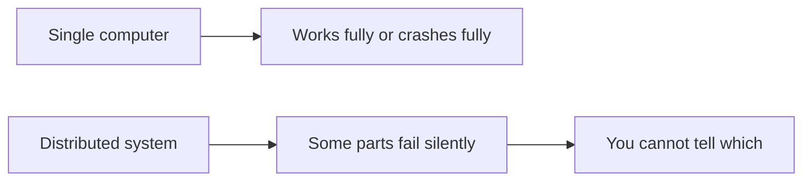
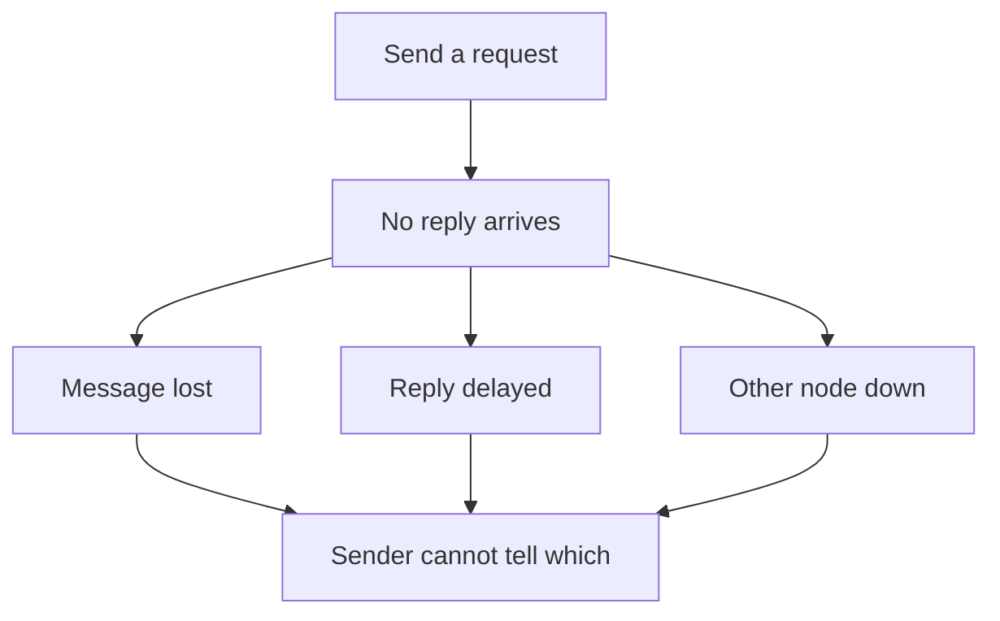

# The Trouble with Distributed Systems

## Recap — Where We Just Were

In [[Ch07 - Transactions]] we got a superpower: a transaction lets a bunch of reads and writes act like one clean, all-or-nothing step. If anything goes wrong, it rolls back and it's like nothing happened. That let us stop worrying about half-finished messes.

But transactions hide a big assumption: that the database is *one* thing you can trust to give you a clear yes or no. In this chapter that comfort disappears. We spread the work across many machines talking over a network, and suddenly the answers stop being clear. Welcome to the hard part.

## Level 1 — The Big Idea

Here's the whole chapter in one contrast.

A single computer is honest with you. It either works, or it crashes completely. That's *deterministic* — same input, same result, no surprises. If a function returns, it worked. If the machine dies, everything dies together.

A distributed system (many computers cooperating over a network) breaks that deal. It suffers **partial failures**: some parts work while others fail — and it happens *nondeterministically* (unpredictably, differently each time). Worse, often **you cannot even tell which parts failed**. You send a message and hear nothing. Did it arrive? Is the other machine dead? Just slow? You genuinely don't know.

That uncertainty — not knowing what's true — *is* the whole problem of this chapter. Everything else is coping strategies.



## Level 2 — How It Actually Works

Three things you'd love to trust all turn out to be liars.

**1. The network lies.** Most distributed systems use *asynchronous packet networks* — you fling a message out and hope. A message can be lost, delayed, or the receiver might be down. And here's the cruel part: from the sender's side, **these all look identical**. Silence tells you nothing.

Your only tool is a **timeout**: wait a while, and if no reply comes, assume failure. But a timeout is a *guess*. Too short, and you declare a healthy-but-slow node dead (a false alarm). Too long, and users sit waiting forever before anyone notices a real crash. There's no perfect number. When the network drops messages between whole groups of nodes, that's a **network partition** (nicknamed a "netsplit").

**2. The clock lies.** Every machine has a clock, but clocks *drift* (run slightly fast or slow) and are only loosely synced. Using timestamps to order events across machines is dangerous — a clock can even jump *backward* — so "last write wins" can silently throw away data.

**3. Your own process can freeze.** A thread can be paused at *any* moment, mid-line. A garbage-collection "stop the world" pause freezes everything. A virtual machine gets suspended; a laptop lid closes. So a node that holds a lease (a time-limited "you're the leader" pass) might pause *past* its expiry, wake up still believing it's the leader, and stomp on data.



## Level 3 — See It With Real Numbers

Rough, illustrative sizes so the danger feels real:

- A **GC pause** can freeze a process for hundreds of milliseconds, and in bad cases several *seconds*. That's ages — a leader could miss its whole lease window while frozen.
- **Clock drift** on a normal server can be several milliseconds, and when NTP (Network Time Protocol, which syncs clocks) *steps* the clock, the jump can be larger — sometimes backward.
- Network delay isn't fixed either. It swells because of **queueing**: packets wait in queues inside the network, the operating system, and the app. Congestion makes it wildly variable.

Now the classic fix for the frozen-leader problem: **fencing tokens**. The lock service hands out an ever-increasing number every time it grants the lock. The storage rejects any write carrying a token *smaller* than one it has already seen. A stale leader that wakes up late is simply locked out.

```python
highest_token = 0  # storage remembers the biggest token it has honored

def write(token, data):
    global highest_token
    if token <= highest_token:
        reject("stale leader, fenced out")   # a late waker lands here
    else:
        highest_token = token
        apply(data)                          # accept and remember
```

If a frozen leader holding token 33 wakes up after a new leader used token 34, its write gets bounced. No corruption. The number is the truth, not the node's opinion.

## Level 4 — In the Real World and Common Traps

**Named use case: a lock service like ZooKeeper.** It hands out fencing tokens so many workers can safely share one file or storage system — exactly the pattern above. And **Google Spanner** uses a clock service called **TrueTime** to order transactions across the whole planet: instead of a single timestamp, TrueTime returns a *time interval* with a confidence bound ("it's somewhere between here and here"), then deliberately **waits out** that uncertainty before committing, so orderings never overlap wrongly.

Three traps people fall into:

- **People think:** the network is reliable and latency is basically zero. **Actually:** these are the famous *Fallacies of Distributed Computing*. Networks lose packets, delay them, and stall — plan for it.
- **People think:** a timeout means the other node is definitely dead. **Actually:** it might be alive but slow — and it may have *already done the work you asked*. So a blind retry can double-apply the action (charge the card twice).
- **People think:** computer clocks are accurate enough to order events across servers. **Actually:** they drift and can jump backward, so timestamps are not a safe global order.

## Level 5 — Expert View

Since no single node can trust its own view, real systems don't let one node decide anything important. Decisions come from a **quorum** — a majority vote among nodes. A majority can't *all* be wrong-in-the-same-way at once, so it's the closest thing to "truth" you get.

Engineers also pin down their assumptions with **system models** (how timing behaves) and **fault models** (how nodes fail). The realistic system model is *partially synchronous*: usually timely, occasionally not. The fault models:

| Fault model | What the node does | Trust level | Where it shows up |
|---|---|---|---|
| Crash-stop | Dies and stays dead | Simple to reason about | Basic assumption |
| Crash-recovery | Dies then comes back | Must survive restarts | Most real datacenters |
| Byzantine | Lies or acts arbitrarily | Trust nothing | Aerospace, blockchains |

Byzantine faults (nodes actively lying) are usually out of scope inside one trusted company — you assume your own servers aren't malicious, just unreliable. The deep lesson: you **cannot eliminate uncertainty**. You can only *design around* it — with timeouts, quorums, and fencing tokens.

## Check Yourself

**Memory hook:** *In a distributed system the network lies, the clock lies, and your own process can freeze; trust a majority and a fencing token, never a single node.*

**Q:** Why is a partial failure harder to handle than a full crash?
**A:** A full crash is deterministic — everything's down, you know where you stand. A partial failure is nondeterministic and often invisible: some parts work, some don't, and you usually can't tell which, so you can't act with confidence.

**Q:** Why is picking a timeout value a no-win guess?
**A:** Too short falsely declares healthy-but-slow nodes dead; too long makes users wait ages before a real failure is noticed. There's no value that avoids both.

**Q:** How does a fencing token stop a paused leader from corrupting data?
**A:** Each lock grant carries an ever-increasing number. Storage remembers the highest it has seen and rejects any write with a smaller token, so a stale leader that wakes up late is locked out.

## Connects To

- [[Ch05 - Replication]] — replication already forced us to reason about multiple copies; this chapter explains *why* keeping them in sync is so slippery.
- [[Ch07 - Transactions]] — transactions gave clean guarantees on one node; distributed faults are what threaten those guarantees across many.
- [[01 - Roadmap]] and [[Home]] — where this fits in the bigger map.

## Coming Up Next

We've admitted the ugly truth: uncertainty can't be removed. So how do independent, unreliable machines ever *agree* on anything — one leader, one value, one order? That's the payoff, and it's next in [[Ch09 - Consistency and Consensus]].
