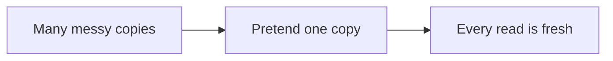
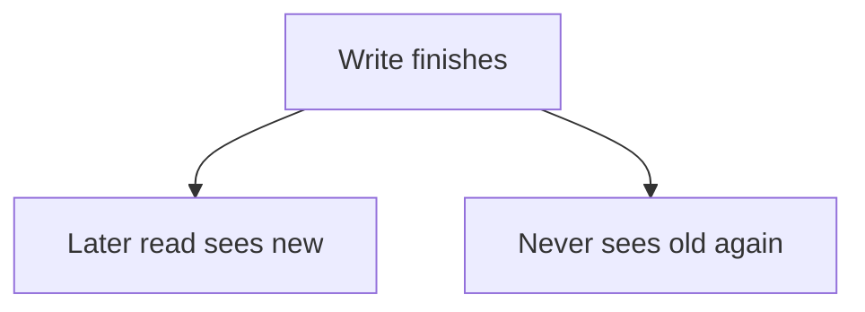
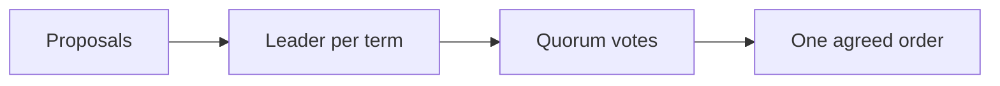

# Consistency and Consensus

## Recap — Where We Just Were

In [[Ch08 - The Trouble with Distributed Systems]] we collected a pile of bad news. Networks drop and delay messages. Clocks lie. Nodes freeze mid-task without warning. A machine can't even trust its own sense of time, and it definitely can't trust that the others are alive.

So here's the obvious next question: given all that chaos, how do we build something that still behaves *correctly*? Not "usually fine" — actually correct, in a way you can reason about.

This chapter is the answer. It gives us two big tools. First, a strong consistency guarantee called **linearizability** (making many copies act like one). Second, a way to get nodes to **agree** on something, called **consensus**. Almost everything reliable in distributed data rests on these two ideas.

## Level 1 — The Big Idea

Real systems keep multiple copies of data — that's replication from [[Ch05 - Replication]]. Copies drift apart. Reader A might see the new value while reader B still sees the old one. Confusing.

**Linearizability** is a promise that kills that confusion. It says: *behave as if there is only one copy of the data, and every operation happens instantly at a single moment.* (That's the whole trick — the illusion of a single copy.)

The key word is **recency**. Once a write finishes — or once *anyone* has read the new value — every later read must return that new value or something newer. Never an old one. No time travel backwards.



That's linearizability: fake a single always-fresh copy.

## Level 2 — How It Actually Works

Think of a single value in the system as a whiteboard that only one person at a time can touch. Someone writes "5". The instant they finish, the "3" that was there is gone forever, for everybody. Anyone who looks after that sees "5" or later — never "3" again.

Linearizability doesn't care *how* your database spreads copies around. It only judges the *outcome*: does the sequence of reads and writes look like it could have happened on one whiteboard, in one order? If yes, it's linearizable.

Careful — do not confuse this with **serializability** from [[Ch07 - Transactions]]. Serializability is about whole transactions not stepping on each other (as if they ran one at a time). Linearizability is about a *single register* always looking up to date. Different questions. A system can have one without the other.



## Level 3 — See It With Real Numbers

Linearizability isn't free. To fake one copy, nodes must vote, and voting needs a **majority** — more than half.

The rule: a system can make progress only when the votes agreeing are greater than n divided by 2.

```text
n = 5 nodes:
  majority = 3   (3 > 5/2 = 2.5)   -> tolerate 2 failures
n = 3 nodes:
  majority = 2   (2 > 3/2 = 1.5)   -> tolerate 1 failure

progress requires: votes > n / 2
```

Why a *majority* and not just "some"? Because two different majorities of the same group must always overlap in at least one node. That overlap is what stops two conflicting decisions from both winning.

Now here's linearizability being *broken*, so you know what the guarantee is protecting you from:

```text
time ->
Writer:   [--- write x = 5 completes ---]
Client A:               read x -> 5     (sees new, good)
Client B:                        read x -> 3   (OLD! violation)
```

B read *after* A already saw 5, but got the stale 3. On one whiteboard that's impossible. So this system is not linearizable.

## Level 4 — In the Real World and Common Traps

**Named use case: ZooKeeper and etcd.** These are small, careful coordination services. Big systems like **HBase** and **Kafka** use them for **leader election** ("who is in charge right now?") and **locks** ("only one worker touches this at a time"). Those jobs *require* linearizability — if two nodes both think they're the leader, you get corruption. This is exactly why you need a fresh single-copy view.

**People think X. Actually Y.**

- People think *CAP means "pick any two of consistency, availability, partition-tolerance."* Actually that framing is misleading. Network **partitions** aren't a thing you choose to allow — they just happen. So the real choice appears only *during* a partition: stay **Consistent** (refuse requests on the cut-off side) or stay **Available** (answer everywhere, but maybe with stale data). C vs A, and only then.
- People think *linearizable is just another word for serializable.* Actually no. One is about a single value always being up to date; the other is about transactions not interfering. Different guarantees.
- People think *eventual consistency is fine for everything.* Actually it is not safe for uniqueness constraints, locks, or leader election. Those need linearizability, full stop.

One more real cost: linearizable systems are **slower even when nothing is broken**, because every operation waits on network round-trips to check with other nodes.

## Level 5 — Expert View

Zoom out to **ordering**. Which events come before which?

**Causal order** captures "what actually caused what" — a reply comes after the message it answers. But it's only a *partial* order: some events are **concurrent**, meaning neither came first and that's fine. Linearizability is stronger — a *total* order where everything is ranked.

Here's a beautiful fact: **causal consistency is the strongest guarantee that can still stay available during a partition.** Go stronger (linearizable) and a partition forces you to refuse service.

**Lamport timestamps** give you a total order that respects causality — but they can't tell you *when* an order is final (has everyone weighed in yet?). **Total order broadcast** (also called atomic broadcast) fixes that: it delivers the same messages to every node, in the same order, exactly once. And — surprise — that turns out to be *equivalent to consensus*. Same problem wearing a different hat.

| Aspect | Causal consistency | Linearizability |
|---|---|---|
| Order type | Partial (concurrent events unordered) | Total (everything ordered) |
| Recency promise | Weaker, no single fresh copy | Strong, one always-fresh copy |
| Available during a partition? | Yes (strongest that can be) | No (must refuse on cut-off side) |
| Cost | Cheaper, no global round-trips | Slower, network round-trips per op |

**The trade-off:** strong consistency buys you correctness but you pay in latency and lost availability. So prefer causal or eventual consistency where you *can* get away with it — and reach for linearizable only where you genuinely must (locks, uniqueness, leader election).

## Level 6 — Consensus and Coordination

**Consensus** is the deep problem underneath all of this: get several nodes to **agree on one value** despite crashes and delays. It sounds simple. It is famously hard.

A real consensus algorithm must guarantee four properties:

- **Uniform agreement** — no two nodes decide differently.
- **Integrity** — a node decides at most once (no flip-flopping).
- **Validity** — the chosen value was actually proposed by someone (no inventing values).
- **Termination** — if a majority stays up, a decision eventually gets made.

The famous algorithms — **Raft**, **Paxos** (Multi-Paxos), **Zab** (the one ZooKeeper uses), and **Viewstamped Replication** — all share a shape. They elect a leader for a numbered period (a "term" or "epoch"), then use **quorum voting** plus **total order broadcast** to agree on a sequence of decisions.

Compare that to **two-phase commit (2PC)**, an atomic-commit protocol with a single **coordinator**. If the coordinator crashes at the wrong moment, everyone else **blocks** — stuck waiting. That single point of failure is exactly what real consensus avoids by relying on a *majority* instead of one boss. (Consensus does still need a majority up, and usually a fixed set of members.)



You almost never write Raft yourself. **Coordination services** — ZooKeeper, etcd — package consensus into a friendly box, so your app gets leader election, membership, and **fencing tokens** (a counter that stops a zombie old-leader from doing damage) without you implementing any of the hard math.

## Check Yourself

**Memory hook:** *Linearizable = one always-fresh copy; under a partition pick C or A; consensus is a majority agreeing on one order.*

**Q:** What single word best captures linearizability's promise?
**A:** Recency. Once a write completes (or any reader sees it), every later read returns that value or newer — never an older one.

**Q:** During a network partition, what does CAP actually force you to choose?
**A:** Consistency *or* Availability — not "two of three." Partitions aren't optional, so the real choice is: refuse requests on the cut-off side to stay linearizable, or answer everywhere with possibly stale data.

**Q:** In a 5-node consensus system, how many must agree, and how many failures can it survive?
**A:** 3 must agree (a majority, since 3 > 5/2), and it tolerates 2 failures.

## Connects To

- [[Ch05 - Replication]] — copies drift; linearizability is the promise to hide that drift.
- [[Ch07 - Transactions]] — serializability (transactions) vs linearizability (a single register): don't confuse them.
- [[Ch08 - The Trouble with Distributed Systems]] — the faults that make agreement hard in the first place.
- [[01 - Roadmap]] and [[Home]] — where this chapter sits in the whole book.

## Coming Up Next

We've spent Part II fighting to keep *online* systems correct, one operation at a time. Next, [[Ch10 - Batch Processing]] flips the frame: instead of responding to live requests, we take a huge fixed pile of data and grind through all of it at once — a totally different, and oddly relaxing, way to build reliable systems.
