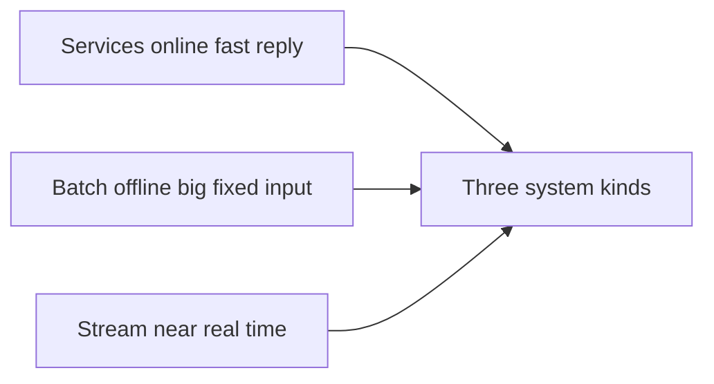
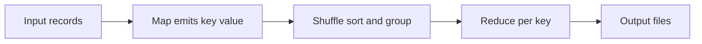

# Batch Processing

## Recap — Where We Just Were

In [[Ch09 - Consistency and Consensus]] we wrestled with the hardest online problem: many machines agreeing on one truth *right now*, while requests keep pouring in and failures keep happening. Consensus is expensive because it's happening *live* — every millisecond counts, and the system can never say "hold on, come back later."

Now we switch gears completely. What if you *don't* need an answer right now? What if you have a giant pile of data already sitting on disk, and you just want to grind through all of it and produce a result? No users are waiting. You can take minutes, or hours. That relaxed world is **batch processing**, and it turns out to be one of the most powerful, reliable tools in all of data engineering.

## Level 1 — The Big Idea

There are three kinds of data systems, sorted by how they treat time:

- **Services (online):** wait for a request, respond as fast as possible. Measured by **response time** (how quickly one request comes back).
- **Batch (offline):** take a big **fixed** input (a file that doesn't change), crunch all of it, produce an output. Measured by **throughput** (how much total data you chew through per hour). Can run for minutes or hours.
- **Stream (near-real-time):** sits between the two — processes data soon after it arrives, but doesn't wait for a full request.

This chapter is about **batch**. The magic trick: because the input is fixed and never modified, you can *re-run the whole thing safely* whenever you want. Mess up? Just run it again. That single property — immutable input — is what makes batch systems so robust.



## Level 2 — How It Actually Works

Batch processing was born from the **Unix philosophy**, decades before big data. The idea: build **small tools that each do one thing well**, connect them with **pipes** (`|`), and give everything a **uniform interface** — every tool reads a stream of bytes from stdin and writes a stream of bytes to stdout. Because tools all speak the same "file of text" language, you can chain any of them together like LEGO bricks.

Two ideas Unix pioneered, which **MapReduce** later inherited:

- **Inputs are immutable** — a tool never changes its input, so you can re-run and experiment freely.
- **Logic is separated from wiring** — each tool is "dumb" about where its data comes from or goes; the pipe handles that.

**MapReduce** is the same idea scaled to *thousands of machines* using a **distributed filesystem** (HDFS, modelled on Google's GFS — "gloss: it spreads one big file across many disks on many computers"). You write two functions:

- **Map** — called once per input record; emits key-value pairs.
- **Reduce** — called once per key; processes all the values that share that key.

Between them, the framework does the **shuffle**: it **sorts and groups** every map output by key, so each reducer sees one key's values bunched together. A clever bonus — MapReduce brings the **computation to the data**: it runs each map task on the machine that already holds that chunk of file, so data doesn't have to travel the network. And it **materializes** (writes to disk) the in-between results — which is exactly how it survives failures: if a task dies, just re-run it, because the inputs never changed.



## Level 3 — See It With Real Numbers

Here's the classic Unix log-analysis pipeline. Imagine a web server log with **millions** of lines, each recording one page request. You want the **top 5 most-requested URLs**:

```bash
cat access.log |          # stream every line, millions of them
  awk '{print $7}' |       # extract just the URL field (column 7)
  sort |                   # group identical URLs next to each other
  uniq -c |               # collapse runs, prepend a count
  sort -rn |              # sort by count, highest first
  head -n 5               # keep only the top 5
```

Follow the shape:

- **Input:** millions of raw log lines.
- **Steps:** extract the URL → sort (so duplicates sit together) → count → rank.
- **Result:** a tiny ranked list, maybe 5 rows.

Notice the pattern: *extract a key, sort by it, then count/combine the grouped values.* That is **exactly** the shape of Map (extract the key) → Shuffle (sort) → Reduce (count). MapReduce does this identical dance, except the "log file" is **terabytes** spread across a cluster of hundreds of machines, and `sort` becomes a distributed sort across the whole network. Same recipe, vastly bigger kitchen.

**Joins in batch:** to combine two datasets by a shared key, a **reduce-side (sort-merge) join** lets the shuffle drag matching records together. But if one dataset is small, a **map-side broadcast hash join** is faster — load the small side into memory on *every* mapper, no shuffle needed. Watch out for **hot keys** (skew) — one wildly popular key can overload a single reducer and needs special handling.

## Level 4 — In the Real World and Common Traps

**Named use case:** Google and early Hadoop used MapReduce to **build the search index for the web** — take the entire crawled internet, and produce the inverted index (Lucene segments) that answers your searches. Real jobs are rarely one step; they're **chains** of many MapReduce stages wired together by a **workflow scheduler** (Airflow, Oozie, Luigi). Companies still run overnight batch jobs to build recommendation models and reports. The output files are **immutable**, so a bad run can never corrupt the old data — you just switch to the new files, or throw the bad ones away.

- **People think:** "MapReduce is dead, so batch doesn't matter." **Actually:** the *model* lives on inside Spark, Flink, and cloud data warehouses. Batch is still the backbone of derived data.
- **People think:** "Joins only belong in databases." **Actually:** batch systems join huge datasets by sorting and grouping — no database required.
- **People think:** "Batch is slow and old-fashioned, so always stream." **Actually:** batch is simpler, trivial to re-run, and perfect whenever your input is a fixed dataset.

## Level 5 — Expert View

Writing every intermediate step to disk (as MapReduce does) is safe but **wasteful** — all that reading and writing and sorting adds up. **Dataflow engines** (Spark, Tez, Flink) fix this: they model the *whole* workflow as one **DAG** ("gloss: directed acyclic graph — a flow chart with no loops"), keep intermediate data **in memory**, skip unnecessary sorting, and recover from faults by **recomputing** lost pieces from their **lineage** (Spark calls its datasets **RDDs**). There are also graph/iterative models (Pregel, bulk synchronous parallel) for algorithms that loop many times.

| Dimension | Services | Batch | Stream |
|-----------|----------|-------|--------|
| Input | one request at a time | big fixed dataset | unbounded, arriving live |
| Latency | milliseconds | minutes to hours | seconds |
| Measured by | response time | throughput | freshness |

| MapReduce vs Dataflow | MapReduce | Dataflow engines |
|-----------------------|-----------|------------------|
| Intermediate state | written to disk | kept in memory |
| Sorting | always sorts between stages | only when needed |
| Fault recovery | re-run failed task | recompute from lineage |

**Trade-off:** reach for **batch** when the input is a large *fixed* dataset and you want repeatable, re-runnable derived data. Move toward **streaming** when the delay of waiting for a full batch actually hurts — when "fresh by tomorrow morning" isn't good enough.

## Check Yourself

**Memory hook:** *Batch = fixed input in, immutable output out; map then shuffle-sort then reduce, and you can always just re-run it.*

**Q:** Why can a batch job safely re-run itself after a crash?
**A:** Because its inputs are **immutable** — they never change — so re-running produces the same result. A dead task just gets restarted.

**Q:** What does the shuffle do between map and reduce?
**A:** It **sorts and groups** all the map outputs by key, so each reducer receives one key's values together.

**Q:** When is a broadcast hash join better than a reduce-side join?
**A:** When one dataset is **small** — load it into memory on every mapper and skip the shuffle entirely.

## Connects To

- [[Ch03 - Storage and Retrieval]] — the sorted, immutable segment files batch jobs produce echo the LSM-tree and index structures from storage engines.
- [[Ch09 - Consistency and Consensus]] — the opposite world: online consensus fights for live agreement, while batch relaxes and re-runs.
- [[01 - Roadmap]] and [[Home]] — batch is the first half of Part III, "Derived Data."

## Coming Up Next

Batch loves a *fixed* input. But real data never stops arriving — it trickles in forever. What if we process each event the moment it lands, instead of waiting to collect a full batch? That's [[Ch11 - Stream Processing]], where the input is unbounded and the clock never stops.
