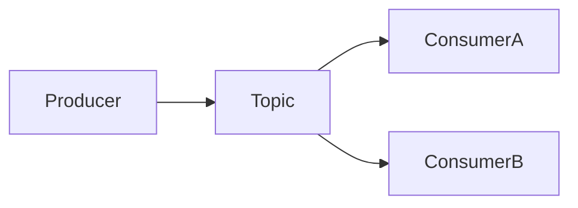
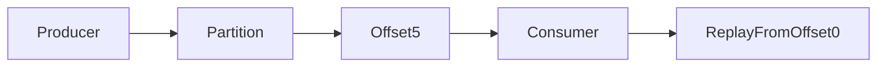

# Stream Processing

## Recap — Where We Just Were

In [[Ch10 - Batch Processing]] we ran big jobs over **bounded** data — a fixed
input that has an end. You point the job at yesterday's logs, it chews through
all of them, and it stops. Clean and repeatable: if it crashes, just run it
again from the start.

But there's a catch. The real world doesn't stop. People keep clicking,
sensors keep reading, payments keep happening. If you only process data once a
day, then a click at 9am waits until midnight to matter. That's a long delay
just to find out something already happened.

Stream processing fixes that gap. Instead of waiting for a pile to finish, you
handle events as they arrive — cutting the lag from hours down to seconds.

## Level 1 — The Big Idea

A **stream** is an endless sequence of **events**. An event is a small,
**immutable** (can't be changed after it's written) record of one thing that
happened at one moment: a click, a payment, a temperature reading.

Two roles pass these around. **Producers** (also called publishers) create
events. **Consumers** (subscribers) read them. Events with the same meaning get
grouped into a **topic** — think of a topic as a labeled channel, like
"payments" or "clicks."

The mindset flip from batch: the input never ends. There is no "last event," so
you never wait for the whole thing. You just keep processing, forever.



## Level 2 — How It Actually Works

Getting events from producers to consumers is the job of a **messaging system**.
There are two ways to hand out messages:

- **Load balancing** — each message goes to **one** of several consumers, to
  split the work. Faster, but any single message is seen by only one worker.
- **Fan-out** — each message goes to **every** consumer. Everyone gets a copy.

Traditional message brokers (using rules called AMQP or JMS — RabbitMQ is one
example) **delete** a message once a consumer acknowledges it. It's read, so
it's gone. That keeps the broker small, but the event is lost forever.

**Log-based message brokers** (Apache Kafka is the famous one) work differently.
They store events in an **append-only log** — you only ever add to the end,
never edit. The log is split into **partitions** so many machines can share the
load. Each consumer remembers its place with an **offset**: just a number saying
"I've read up to here." Because events are **retained** on disk even after being
read, a consumer can **replay** old events simply by resetting its offset to an
earlier number. A delete-on-ack broker can never do that — the message is gone.

So a log-based broker gives you database-like durability *and* messaging, high
throughput, and guaranteed ordering **within** a single partition.



## Level 3 — See It With Real Numbers

Say Kafka is set to **retain events for 7 days** (a made-up but typical number).
That means a brand-new consumer can start at offset 0 and **replay a full week
of history** before catching up to live events. Nothing was thrown away.

Here's the heart of a consumer — a loop that reads, processes, then records how
far it got:

```python
offset = load_saved_offset()      # where I left off, e.g. 4200

while True:
    event = topic.read_at(offset) # get the next event
    process(event)                # do the real work
    offset = offset + 1
    commit(offset)                # save my place: "read up to here"
```

Notice the danger zone: if the machine crashes **after** `process(event)` but
**before** `commit(offset)`, the saved offset still points at the old spot. On
restart it reads that same event again — it gets **reprocessed**. That's why
operations should be **idempotent** (safe to apply twice with the same result),
like "set balance to 100" instead of "add 100."

You also usually bucket events by **when they happened**, not when they arrived:

```python
counts = {}
for event in stream:
    minute = event.event_time // 60   # group by the event's own timestamp
    counts[minute] = counts.get(minute, 0) + 1
```

## Level 4 — In the Real World and Common Traps

**Use case: real-time fraud detection and live dashboards.** Card swipes stream
into Kafka, a stream processor like **Flink** or **Kafka Streams** scores each
one against recent activity, and a suspicious pattern gets flagged in seconds —
not tomorrow. The same pipe can keep a search index in sync: every database
write becomes an event (see CDC below) so the index never drifts.

**People think X. Actually Y.**

- *People think streaming replaces batch.* Actually they **unify**. You often
  reprocess full history with batch and keep the present fresh with streaming.
  (These are the Lambda and simplified Kappa architectures.)
- *People think "exactly-once" means each event is literally handled one time.*
  Actually, under the hood it may reprocess after a crash — it just makes the
  **effect** land once, using idempotence and transactional offset commits.
- *People think event time equals processing time.* Actually no. A phone that
  was offline can deliver an event hours late, so you must bucket by **event
  time** or your counts land in the wrong hour.

Two more real ideas to know. **Change Data Capture (CDC)** turns every write in
a database into a stream of change events, so other systems stay in sync by
consuming it. **Event sourcing** goes further: the **log of events** *is* the
source of truth, and the current state is just a **materialized view** — a
derived, re-computable summary you rebuild by replaying the log. That ties
straight back to replication logs in [[Ch05 - Replication]] and the wire formats
in [[Ch04 - Encoding and Evolution]].

## Level 5 — Expert View

The trickiest part of streaming is **time**. **Processing time** is when your
machine handles an event; **event time** is when it actually happened. They
differ because of network delays, buffering, and offline devices.

To count over time you use **windows**: tumbling (fixed, non-overlapping),
hopping, sliding, and session windows. The hard question is "when is a window
**complete**?" You can never be *sure* no more late events will show up. So
systems use a **watermark** — a marker saying "events older than this are
probably all here" — and still handle **stragglers** (late arrivals) specially.

**Joins** combine streams: stream-stream (match two event streams inside a time
window), stream-table (**enrich** an event by looking it up in a table, often a
local CDC copy), and table-table (keep a materialized view current). All are
time-dependent because the table changes as time passes.

Since you can't just re-run an infinite input, **fault tolerance** uses
**microbatching** (Spark Streaming slices the stream into tiny batches),
**checkpointing** (Flink periodically saves its state), plus idempotence — the
recipe for "effectively-once" results.

| Aspect | Event time | Processing time |
|--------|-----------|-----------------|
| Meaning | When it really happened | When your machine saw it |
| Set by | The producing device | The consumer |
| Late/offline devices | Handled correctly | Land in the wrong bucket |
| Best for | Accurate counts and windows | Rough "how busy am I now" |

**Trade-off:** streaming buys you freshness — answers in seconds — but it adds
real complexity around time, ordering, and keeping state alive. Batch is simpler
to reason about; streaming is faster to react. Most serious systems use both.

## Check Yourself

**Memory hook:** *A stream is an endless log of immutable events; keep the log,
replay by offset, and always bucket by event time not arrival time.*

**Q:** Why can a Kafka consumer replay old events but a RabbitMQ-style broker
can't?
**A:** Kafka **retains** events in an append-only log, so a consumer just resets
its **offset** to reread them. A traditional broker **deletes** each message on
acknowledgment, so it's already gone.

**Q:** Your consumer crashes after processing an event but before committing its
offset. What happens, and how do you stay correct?
**A:** On restart it reads and **reprocesses** that event. You stay correct by
making the operation **idempotent** — applying it twice gives the same result.

**Q:** Why must you group events by event time instead of processing time?
**A:** An offline device can deliver an event hours late. Grouped by arrival, it
lands in the wrong window; grouped by **event time**, it lands where it belongs.

## Connects To

- [[Ch10 - Batch Processing]] — bounded jobs; streaming is its unbounded twin.
- [[Ch05 - Replication]] — replication logs are the same log-of-changes idea.
- [[Ch04 - Encoding and Evolution]] — events need stable, evolvable encodings.
- [[01 - Roadmap]] and [[Home]] — where this sits in the whole book.

## Coming Up Next

Streams and batch are two ways to build **derived data**. Next,
[[Ch12 - The Future of Data Systems]] steps back and asks how to weave batch,
streaming, and databases into one trustworthy whole — and where data systems are
heading.
