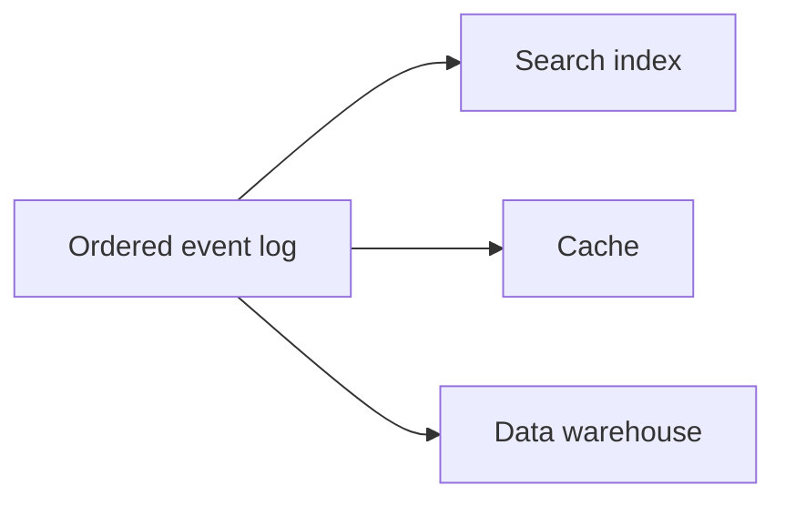
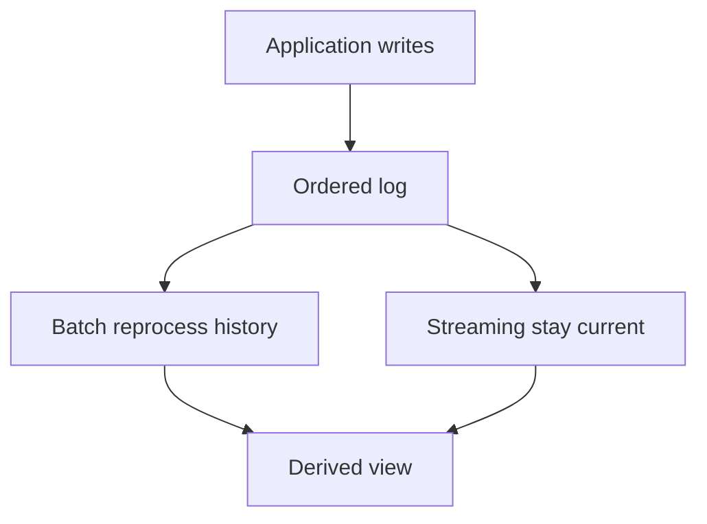

# The Future of Data Systems

## Recap — Where We Just Were

In [[Ch11 - Stream Processing]] you learned to treat data as an endless river of events instead of a still pond. Every change — an order placed, a name updated, a click — becomes an immutable fact appended to a log. Stream processors read that log and react in near real time.

Two ideas from that chapter are the keys to this whole finale:

- **Change data capture (CDC)** — turning every write to a database into an event on a log.
- **Event sourcing** — storing the events themselves as the truth, and computing everything else from them.

Hold onto those. This last chapter zooms all the way out and asks the biggest question in the book: given everything you now know, how should we build data systems *of the future*? The answer ties every earlier chapter together.

## Level 1 — The Big Idea

Here is the honest lesson of the entire book, stated plainly: **no single tool does everything well.**

A database is great at storing rows. A search index is great at finding text. A cache is great at being fast. A data warehouse is great at big analytics questions. But none of them is great at all four. So real systems are not one magic database — they *compose* many specialized tools.

That raises a hard problem: if the same fact (say, a product's price) lives in a database *and* a search index *and* a cache, how do you keep them in sync? Kleppmann's answer, his thesis for the future, is to stop thinking about one all-powerful database and start thinking in terms of **dataflow** and **derived data**.

**Derived data** = data computed from other data, which you can always throw away and rebuild. The search index is derived. The cache is derived. Only the log of events is the real source of truth.



One source of truth, many rebuildable views fed from it. That's the whole picture.

## Level 2 — How It Actually Works

The problem of keeping many systems in sync is called **data integration**. The clean solution has two moves.

**Move 1: funnel all writes through one ordered log.** Instead of letting the app write directly to the database, the search index, and the cache separately (three chances to disagree), you make *every* write an event appended to a single log with a **total order** — every subscriber sees the same events in the same sequence. You already have the tools: total order broadcast, CDC, and event sourcing from [[Ch11 - Stream Processing]].

**Move 2: derive everything else as materialized views.** A **materialized view** is a re-computable summary that *subscribes* to the log. The search index subscribes and updates itself. The cache subscribes and updates itself. The warehouse subscribes and updates itself. Each is just a view of the same log, kept current by streaming.

The magic payoff: because the log is the single source of truth and the views are rebuildable, **you can fix a bug by reprocessing history.** Wrote buggy indexing code? Fix it, then run a batch job over the whole log ([[Ch10 - Batch Processing]]) to rebuild the index from scratch, while streaming keeps you current. This unifies batch and streaming — the older **Lambda architecture** and its simpler successors.



This is also the idea called **unbundling the database**. A traditional database *bundles* storage, secondary indexes, materialized views, replication, and caching inside one box. Kleppmann's "database inside-out" idea is to **unbundle** those parts into separate, composable systems, wired together by the log — the Unix philosophy ([[Ch10 - Batch Processing]]) of small tools piped together, but applied to whole databases.

The best mental model is a **spreadsheet**. Change one source cell, and every cell derived from it updates automatically. Designing applications around dataflow works the same way: change a source fact, and all the derived views update themselves. Even a precomputed cache stops being a thing you manually refresh — it becomes derived, subscribable data.

## Level 3 — See It With Real Numbers

Let's wire a real e-commerce order as dataflow.

A customer buys headphones. Instead of the app writing to five systems, it appends **one event** to the order log:

```
order_id=A1  request_id=req-77  item=headphones  price=89
```

From that single event, four subscribers each derive their own view:

1. **Search index** — so "headphones" is findable.
2. **Cache** — so the product page loads fast.
3. **Data warehouse** — so analysts can ask "how many headphones sold this week."
4. **Confirmation email** — a stream processor sees the event and sends the receipt.

One write fans out to four derived outcomes. Nobody had to keep them in sync by hand — they all read the same ordered log.

Now the danger: networks retry. If the "place order" request times out and the client sends it again, you could **charge twice**. The fix is the **end-to-end argument** (next section) made concrete: give each request a unique id and make applying it **idempotent** — doing it twice has the exact same effect as doing it once.

```
processed = set()   # ids we've already applied

def apply_order(event):
    if event.request_id in processed:
        return                # retry -> do nothing, no double charge
    charge(event.price)
    append_to_log(event)
    processed.add(event.request_id)
```

Retry `req-77` a hundred times: charged once. The `request_id` is what makes the second attempt a no-op.

## Level 4 — In the Real World and Common Traps

**Named use case: an online shop wired as dataflow.** One order log is the source of truth; the search index, the recommendations, the warehouse, the emails, and the fraud checks are all derived views subscribing to it. Fix a bug in any view, replay the log, rebuild it. Add a brand-new view next year? Point it at the log's history and let it catch up. No migration meeting required.

**People think X. Actually Y.**

- **People think:** "One day there will be a single database that does *everything*." **Actually:** no. The future is composing specialized tools around a shared log. The all-in-one database is a fantasy; different jobs need different engines.
- **People think:** "To be correct you need strong distributed transactions and linearizability." **Actually:** often **idempotence plus end-to-end checks** give you integrity far more cheaply, without the coordination cost of full transactions.
- **People think:** "Collecting more data is always good." **Actually:** data carries ethical and privacy costs. It can become a **liability**, not just an asset — a breach waiting to happen, or a tool for unfair decisions.

**Aiming for correctness.** The **end-to-end argument** says some correctness properties can only be guaranteed by the *ends* of a system (the application), not by the plumbing in the middle. Preventing a double charge is an app-level promise: the network can't make it for you. Combine a unique operation id + idempotence with **fencing tokens** from [[Ch09 - Consistency and Consensus]], and you get **exactly-once effects without full distributed transactions**.

You can even enforce **uniqueness constraints** in a log-based world. Two people both grab the username `zoe`? Route all writes for that username to the **same log partition**, and let log order decide: first one wins, second is rejected. No global lock needed — order does the refereeing.

**Trust, but verify.** Storage silently corrupts sometimes; bits rot, disks lie. Don't blindly assume the lower layers are perfect. **Audit** your data with end-to-end checks so you *notice* when something's wrong.

## Level 5 — Expert View

Two promises people mix up: **timeliness** and **integrity**.

- **Timeliness** = users see up-to-date data. Being merely *eventually* up to date is often perfectly fine — a slightly stale product view rarely hurts.
- **Integrity** = data is never lost, corrupted, or double-counted. This matters *far* more. And the key insight: you can get strong integrity through **idempotence, dataflow, and end-to-end checks** — *without* paying for linearizability ([[Ch09 - Consistency and Consensus]]).

| | Timeliness | Integrity |
|---|---|---|
| What it promises | Data is fresh, up to date | Data is never lost or double-counted |
| How strict | Loose — eventual is usually fine | Strict — violations are real bugs |
| How achieved | Fast replication, streaming | Idempotence, dataflow, end-to-end audit |
| If it slips | Minor — a short stale window | Serious — corruption or wrong charges |

**Trade-off.** Dataflow architectures buy you flexibility, rebuildability, and looser coupling — add a new view anytime, fix bugs by replaying, let tools specialize. The price is more moving parts and *eventual*, not instant, consistency. You trade "one tidy box" for "many pieces you can independently evolve."

**Doing the right thing.** Kleppmann ends the book on ethics, and so do we. Powerful data systems can cause real harm: biased predictive analytics, unfair automated decisions, feedback loops that reinforce discrimination, surveillance, and the slow erosion of privacy. **Consent is often not truly informed** — people click "agree" without any real understanding. Data can be a liability. The people who build these systems — you, maybe, one day — carry responsibility for how they affect real human lives. Engineering skill without that responsibility is dangerous.

## Check Yourself

**Memory hook:** *The future is dataflow: one ordered log as the source of truth, everything else a rebuildable view, correctness pinned at the ends with idempotence.*

**Q:** Why can't one giant database just do storage, search, caching, and analytics all at once?
**A:** No single tool does everything well. Each job needs a specialized engine, so real systems *compose* many tools and keep them in sync through a shared ordered log.

**Q:** How does giving each request a unique id prevent a retried order from charging twice?
**A:** The apply step is idempotent — it records processed ids and skips any it has seen, so applying the same request twice has the same effect as once (exactly-once effect, no distributed transaction needed).

**Q:** What's the difference between timeliness and integrity, and which can you get without linearizability?
**A:** Timeliness = data is fresh (eventual is often fine). Integrity = data is never lost or double-counted (matters far more). You can achieve integrity via idempotence, dataflow, and end-to-end checks *without* linearizability.

## Connects To

- [[Ch11 - Stream Processing]] — the ordered log, CDC, and event sourcing that make derived data possible.
- [[Ch10 - Batch Processing]] — replaying history to rebuild views, and the Unix philosophy behind unbundling.
- [[Ch09 - Consistency and Consensus]] — total order broadcast, fencing tokens, and the linearizability you can often skip.
- [[Ch07 - Transactions]] — the strong guarantees that idempotence and end-to-end checks partly replace.
- [[Ch03 - Storage and Retrieval]] — the indexes and materialized views that unbundling pulls out of the database.

## Coming Up Next

There is no next chapter — you've reached the end. You walked the whole book: from one machine ([[Ch03 - Storage and Retrieval]], [[Ch07 - Transactions]]), to many machines cooperating ([[Ch09 - Consistency and Consensus]]), to data flowing and being derived ([[Ch10 - Batch Processing]], [[Ch11 - Stream Processing]]), and finally to this capstone view of systems built around dataflow.

Now make it stick. Go back to [[Home]] and [[01 - Roadmap]] and re-read them as a *capstone review* — this time the map will mean something. Then revisit the chapters that fought you hardest; for most people that's [[Ch09 - Consistency and Consensus]] (consensus is genuinely hard) and [[Ch07 - Transactions]] (isolation levels take a second pass). You know the whole shape now, so the hard parts will land differently. Well done finishing the walk.
