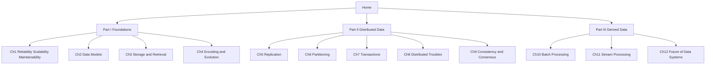

# 🏠 DDIA Learning Vault — Home

A beginner-proof, connected course through **_Designing Data-Intensive
Applications_** by Martin Kleppmann. Every chapter is one laddered lesson: a big
idea, the real mechanism with diagrams, real numbers, a real-world use case, common
traps, an expert contrast, and a self-check. Read them in order.

> New here? Start with [[00 - Index and Methodology]] → [[01 - Roadmap]] → Chapter 1.
> Track your progress in the [[Log|Ingestion Log]].

## The map

## Meta

- [[00 - Index and Methodology]] — how this course teaches (the panel + the ladder).
- [[01 - Roadmap]] — full syllabus, learning order, prerequisites, milestones.
- [[Log|Ingestion Log]] — append-only history of what was added and when.

## Part I — Foundations of Data Systems

- [[Ch01 - Reliable, Scalable, Maintainable Applications]] — the scorecard for every system. *(also broken into 10 bite-size [[Ch01 - Concept Map|concept lessons]])*
- [[Ch02 - Data Models and Query Languages]] — relational vs document vs graph.
- [[Ch03 - Storage and Retrieval]] — LSM-trees, B-trees, OLTP vs OLAP.
- [[Ch04 - Encoding and Evolution]] — changing your data format without breaking things.

## Part II — Distributed Data

- [[Ch05 - Replication]] — copies of the same data on many machines.
- [[Ch06 - Partitioning]] — splitting a big dataset into shards.
- [[Ch07 - Transactions]] — ACID, isolation levels, and serializability.
- [[Ch08 - The Trouble with Distributed Systems]] — lying networks, clocks, and processes.
- [[Ch09 - Consistency and Consensus]] — linearizability, CAP, and consensus.

## Part III — Derived Data

- [[Ch10 - Batch Processing]] — MapReduce and the Unix philosophy.
- [[Ch11 - Stream Processing]] — event streams, Kafka, event time.
- [[Ch12 - The Future of Data Systems]] — unbundling the database into dataflow.

## How each lesson is built

Every chapter climbs the same ladder so you always know where you are: **Big Idea →
How It Works → Real Numbers → Real World & Traps → Expert View → Check Yourself**,
with mandatory `mermaid` diagrams and 3 self-test questions. See
[[00 - Index and Methodology]] for the full contract.
