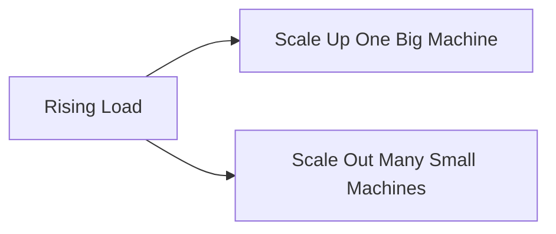
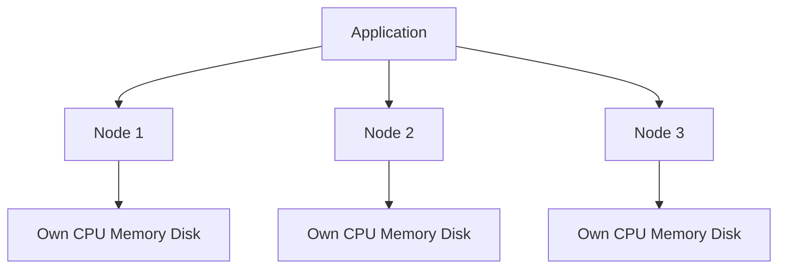

# Approaches for Coping with Load

## Recap — Where We Just Were   (bridge from [[Describing Performance]])

In [[Describing Performance]] you learned how to *measure* a system: pick a load parameter, watch response times, and use percentiles (p50, p99 — the response time that 99 out of 100 requests beat) instead of averages.

But measuring is only step one. Once you know load is climbing, the real question shows up: how do you keep performance good as the numbers grow? That is what this note is about.

## Level 1 — The Big Idea   (scaling up vs out)

There are basically two ways to handle more load.

- **Scaling up** (also called *vertical scaling*): get one bigger, more powerful machine. More CPU, more memory, faster disks.
- **Scaling out** (also called *horizontal scaling*): keep the machines small, but use *many* of them and spread the load across them.

Analogy: imagine a pizza shop getting swamped with orders. Scaling up is hiring one superhuman chef who cooks ten times faster. Scaling out is hiring ten normal chefs who each cook a share of the orders. Both make more pizza — but they cost different amounts and break in different ways.

## Level 2 — How It Actually Works   (vertical vs horizontal, shared-nothing, elasticity)

**Vertical (scale up)** is *simpler*. One machine means one thing to reason about. The catch: top-end hardware gets disproportionately expensive — doubling the power can far more than double the price. So heavy workloads usually get pushed toward scaling out whether you like it or not.

**Horizontal (scale out)** spreads work across many machines, each with its own CPU, memory, and disk that it does not share with the others. That setup has a name: a **shared-nothing architecture** (no shared central resource that becomes a bottleneck). It is the foundation for splitting data into pieces later on.

Real systems are rarely pure. Good architectures are *pragmatic hybrids* — sometimes a few powerful machines beat a huge swarm of tiny ones, on both simplicity *and* cost.

A separate dial is **elasticity** (how a system reacts to changing load):
- **Elastic** systems add resources *automatically* when they detect rising load.
- **Manually scaled** systems rely on a human noticing and adding machines.

Elasticity helps when load is unpredictable, but manual scaling is simpler and springs fewer surprises.

One more key point: spreading out *stateless* services (ones that keep no data between requests) is easy. Spreading out *stateful* data systems — databases — is genuinely hard. So the old convention was: keep the database on one node and scale it up until cost or availability forces you outward.

## Level 3 — See It With Real Numbers

The book gives a sharp illustration. Consider two systems with the *same* throughput:

- System A: **100,000 requests per second**, each request carrying **1 kB** of data.
- System B: **3 requests per minute**, each carrying **2 GB** of data.

Multiply it out and both move roughly the same total bytes over time. Same throughput number. But their designs must be *completely* different. System A needs to juggle a flood of tiny requests fast; System B needs to move a few enormous chunks. One number, two opposite machines.

Now the cost side of scale-up vs scale-out. Suppose one commodity (ordinary, off-the-shelf) machine handles 10,000 requests/sec. To reach 100,000 requests/sec:

- **Scale out:** roughly 10 commodity machines. Cost grows in a fairly straight line.
- **Scale up:** one giant machine doing 100,000/sec — if it even exists, its price is far more than 10x a normal box, because top-tier hardware carries a steep premium.

(These figures are illustrative, to show the *shape* of the trade-off.)

## Level 4 — In the Real World and Common Traps

Fast-growing services rebuild their architecture roughly **every order of magnitude** (every 10x jump) in load. An architecture that works fine today will likely buckle at ten times the load. Big services you use daily have been re-architected several times as they grew.

Kleppmann (the book's author) even suggests the "keep the database on one node" wisdom may expire: as distributed tools get better, distributed data systems could become the default even for modest apps.

Misconceptions to clear up:

- **People think** there is a single "best" scalable architecture you can just copy. **Actually** there is no magic scaling sauce. The binding constraint might be read volume, write volume, data volume, complexity, or response-time needs — usually a mix — and each combination wants a different design.
- **People think** scaling out is always better than scaling up. **Actually** one machine is simpler and often cheaper; a few strong machines can beat a swarm of weak ones. You scale out when cost or size forces it, not by reflex.
- **People think** an early startup should engineer for huge future load. **Actually** premature scaling is a trap — for an unproven product, iterating fast on features beats building for load that may never come.

## Check Yourself

Memory hook: **"Up = one bigger, Out = many smaller, and there is no magic sauce."**

**Q:** What is the difference between scaling up and scaling out?
**A:** Scaling up (vertical) means using one more powerful machine; scaling out (horizontal) means spreading load across many smaller machines.

**Q:** What does *shared-nothing* mean, and which scaling style uses it?
**A:** Each machine has its own CPU, memory, and disk with no shared central resource that could bottleneck. It is used by scaling out (horizontal).

**Q:** Why is there "no magic scaling sauce"?
**A:** Because the binding constraint differs per system (reads, writes, data size, complexity, response time — usually mixed), so every architecture bets on which operations dominate, and no single design fits all.

## Connects To

- [[Describing Load]] — the load parameters an architecture bets on
- [[Describing Performance]] — the metrics that tell you when to re-architect
- [[Ch01 - Reliable, Scalable, Maintainable Applications]] — the chapter this sits in
- [[How Important Is Reliability]] — the reliability side of the same design story

## Coming Up Next

Next: [[Operability - Making Life Easy for Operations]]. We have covered reliability and scalability; now we turn to maintainability, because a system that grows also has to stay easy for people to run and change over time.
