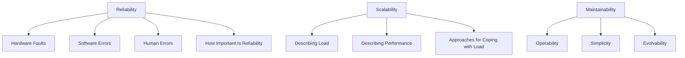

# Chapter 1 — Concept Lessons

The chapter overview lives in [[Ch01 - Reliable, Scalable, Maintainable Applications]].
This page breaks that chapter into **one small beginner lesson per concept**, each
grounded in the source wiki notes and taught with the level ladder. Read them in this
order — they form a continuous path.

## Reliability — keep working when things go wrong
1. [[Hardware Faults]] — disks and machines die; redundancy and the shift to software fault-tolerance.
2. [[Software Errors]] — correlated, systematic bugs that take out many nodes at once.
3. [[Human Errors]] — config mistakes as the leading cause of outages, and how to defend against them.
4. [[How Important Is Reliability]] — when reliability really matters, and when cutting corners is a conscious choice.

## Scalability — cope with growth
5. [[Describing Load]] — load parameters and the Twitter fan-out problem.
6. [[Describing Performance]] — throughput, response time, percentiles, and tail latency.
7. [[Approaches for Coping with Load]] — scaling up vs out, and shared-nothing.

## Maintainability — keep it easy to run and change
8. [[Operability - Making Life Easy for Operations]] — visibility, automation, good defaults.
9. [[Simplicity - Managing Complexity]] — accidental complexity and abstraction as the antidote.
10. [[Evolvability - Making Change Easy]] — designing so change stays cheap.

## Where to go
- Back to the chapter overview: [[Ch01 - Reliable, Scalable, Maintainable Applications]].
- Vault hub: [[Home]] · Course order: [[01 - Roadmap]].
- Next chapter overview: [[Ch02 - Data Models and Query Languages]] (its concept lessons come next).
