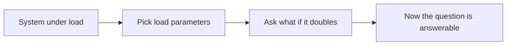
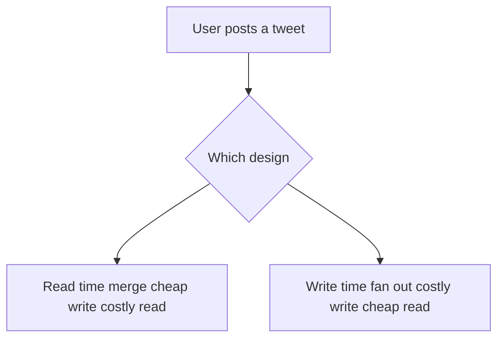

# Describing Load

## Recap — Where We Just Were   (bridge from [[How Important Is Reliability]])

Last time we asked how much a system should fight to keep working when parts of it break — that was reliability. But there's a second question a growing system has to answer: what happens when *more people show up*? A system can be perfectly reliable at 1,000 users and fall over at 1,000,000. Before we can even talk about growth, we need a way to describe how busy a system is right now. That's what this lesson is about.

## Level 1 — The Big Idea   (what a load parameter is + analogy)

Imagine your friend asks, "Will your bike hold up if the load doubles?" You can't answer that until you know what "load" means. Twice as many bags? Twice the distance? Twice the passengers? Each one stresses a different part of the bike.

Software is the same. The question "what happens if load doubles?" is unanswerable until you describe load with concrete numbers. Those numbers are called **load parameters** — the few measurements that actually capture how hard your system is working.

Which numbers matter depends entirely on the design. It might be web requests per second, or a database's ratio of reads to writes, or how many chat users are active at once, or the cache hit rate (how often you find data already saved instead of fetching it fresh). Sometimes the *average* is what hurts you. Sometimes a tiny number of *extreme* cases decide everything. Pick the wrong parameter and you'll spend months optimizing a thing that was never the problem.



## Level 2 — How It Actually Works   (Twitter fan-out, write-path vs read-path)

The book's worked example is Twitter. Twitter has two core operations. **Posting a tweet** writes something once. **Reading your home timeline** — the merged feed of everyone you follow — happens far more often. You'd think posting volume is the hard part, but it isn't. The hard part is **fan-out**.

Fan-out is borrowed from electronics: how many inputs a single output has to drive. In a system like this, it means how many downstream jobs one incoming request creates. When you follow many people and are followed by many people, one tweet can touch a lot of timelines.

There are two ways to build the timeline:

1. **Read-time merge (the read path does the work).** Dump every tweet into one big global pile. When someone opens their timeline, go grab the recent tweets from everyone they follow and merge them right then. Writing is cheap; reading is expensive.
2. **Write-time fan-out (the write path does the work).** Give every user a personal timeline cache, like a mailbox. When you post, push a copy of your tweet straight into the mailbox of every follower. Reading is then trivially cheap — just open your mailbox.

Twitter started with approach 1, got crushed by timeline reads, and switched to approach 2.



## Level 3 — See It With Real Numbers

These are Twitter's figures from November 2012.

| What | Rate |
|------|------|
| Posting a tweet (average) | 4,600 requests/sec |
| Posting a tweet (peak) | above 12,000 requests/sec |
| Reading home timelines | 300,000 requests/sec |

Notice the gap: reads (300k/sec) beat writes (4.6k/sec) by nearly two orders of magnitude — roughly 100 times more. That's *why* moving the work to write-time pays off. You do the extra work on the rare event (posting) so the common event (reading) stays fast.

But approach 2 has a cost. Each tweet must be copied into every follower's cache. At about **75 followers per average tweet**, the write load explodes:

```
4,600 tweets/sec  ×  ~75 followers  ≈  345,000 timeline-cache writes/sec
```

That's write **amplification** — one action multiplied into hundreds. And 75 is only the *average*. Some accounts have **over 30 million followers**, so a single celebrity tweet can trigger **30 million or more** cache writes — and Twitter aims to deliver tweets within about **5 seconds**. That single tweet is a monster hiding inside a calm-looking average.

## Level 4 — In the Real World and Common Traps

Twitter's real answer is a **hybrid**. Most users get write-time fan-out (approach 2). But a handful of celebrities are *exempted* — their tweets are fetched and merged at read time (approach 1) instead of being blasted into 30 million mailboxes. Each user gets the design that suits them.

- **People think** the load parameter is "tweets per second." **Actually** the decisive parameter is the *distribution of followers per user*, weighted by how often they tweet. The raw rate hides the celebrity spike that actually breaks things.
- **People think** more writes is always worse than more reads. **Actually** it depends on the ratio: because reads outnumbered writes ~100 to 1, deliberately *adding* write work to save read work was the smart trade.
- **People think** an average tells you the whole story. **Actually** averages can hide huge skew. A 30-million-follower account and a 10-follower account both count as "one tweet," but they are not remotely the same load.

## Check Yourself

**Memory hook:** *Load is a number you choose — and the celebrity's tweet is the number that bites.*

**Q:** What is a load parameter?
**A:** A concrete number that describes how busy a system is (like requests/sec or read/write ratio), chosen so it captures the real bottleneck.

**Q:** Why did Twitter shift work from read time to write time?
**A:** Timeline reads (300k/sec) outnumbered tweet posts (4.6k/sec) by roughly 100×, so doing the merging once at write time makes the far-more-common read cheap.

**Q:** Why is "followers per user" a better load parameter than "tweets per second"?
**A:** Because fan-out cost depends on followers, and follower counts are wildly skewed — a 30M-follower celebrity tweet creates 30M+ writes that a simple tweet rate completely hides.

## Connects To

- [[Ch01 - Reliable, Scalable, Maintainable Applications]] — this lesson sits inside the Scalability half of that chapter.
- [[How Important Is Reliability]] — the previous idea we bridged from.
- [[Describing Performance]] — how we measure the system once load is described.
- [[Approaches for Coping with Load]] — what to actually do once you know your load.

## Coming Up Next

[[Describing Performance]] — once you can describe *how much* load a system faces, the next question is how to describe *how well* it responds under that load.
