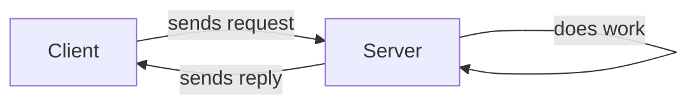
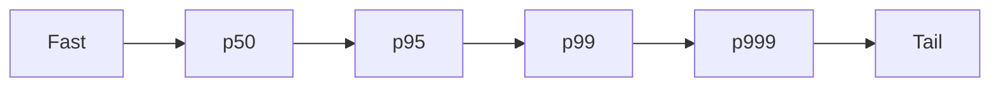

# Describing Performance

## Recap — Where We Just Were   (bridge from [[Describing Load]])
In [[Describing Load]] we learned to put a *number* on how busy a system is — requests per second, reads per write, followers per user. Those are load parameters. But knowing the load only sets up the real question: when the load grows, what happens to the *quality* of the system? Does it slow down, and by how much? To answer honestly we need good ways to measure performance. That is this lesson.

## Level 1 — The Big Idea   (response time vs throughput)
There are two main ways to measure performance, and they answer different questions.

- **Throughput** — how *much* work gets done per unit of time. Records processed per second, or the total time to finish a big job. Batch systems (systems that chew through huge piles of data all at once) care about this.
- **Response time** — how *long* one request takes, measured from the moment a client sends it to the moment the reply arrives. Online systems (systems that answer people live, like a website) care about this.

Analogy: throughput is how many burgers a kitchen makes in an hour. Response time is how long *you* wait for *your* burger. A kitchen can have great throughput and still leave you hungry.

One careful distinction: **response time** is the whole experience the client sees — actual work plus network travel plus time waiting in line. **Latency** is strictly the waiting part, before anyone handles the request.



## Level 2 — How It Actually Works   (why percentiles beat the average)
Here is the trap. Send the *exact same* request many times and you get a *different* response time every time. Why? Background noise: the CPU switching between tasks, a lost network packet being resent, a garbage-collection pause (the system briefly stopping to clean up memory), even a rack of servers vibrating. So response time is not one number. It is a **distribution** — a spread of values.

That means the **average** (mean) is a bad summary. The average tells you nothing about *how many* users had a bad time. A few very fast requests can hide a lot of slow ones.

The honest tool is **percentiles**. Line up every response time from fastest to slowest, then:

- **p50 (the median)** — half of requests are faster, half slower. This is the "typical" user.
- **p95** — 95% of requests are faster than this; 5 in 100 are slower.
- **p99** — 99% faster; 1 in 100 slower.
- **p999** — 99.9% faster; only 1 in 1,000 is slower.

The slow high end (p95, p99, p999) is the **tail** — the *tail latencies*. There is a nasty multiplier here called **tail-latency amplification**: if answering one user means firing off many backend calls in parallel, the user waits for the *slowest* one. So even a rare slow call hits a large share of users — with enough calls, almost every user trips over at least one straggler.



## Level 3 — See It With Real Numbers
Suppose ten requests came back with these response times, in milliseconds:

`[80, 90, 95, 100, 100, 110, 120, 130, 150, 900]`

The **average** is 187.5 ms. That sounds sluggish — but almost nobody actually waited that long. One unlucky request at 900 ms dragged it up.

The **median (p50)** is fairer. Sort the list and look at the middle: it sits between 100 and 110, so about **105 ms** — the real typical experience.

For the **p99**, pick the value at the 99% position. Here is the tiny idea in Python:

```python
def percentile(values, p):
    s = sorted(values)              # 1. sort fastest to slowest
    index = int(len(s) * p)         # 2. find the position for p
    index = min(index, len(s) - 1)  # stay inside the list
    return s[index]                 # 3. pick that value

times = [80, 90, 95, 100, 100, 110, 120, 130, 150, 900]
print(percentile(times, 0.50))  # 110  -> the median-ish middle
print(percentile(times, 0.99))  # 900  -> the tail shows up
```

See what happened? The average (187 ms) *hid* the 900 ms straggler by blending it in. The p99 (900 ms) *exposes* it. That straggler is exactly the customer having a bad day — and the average pretended they did not exist.

## Level 4 — In the Real World and Common Traps
The book's key example: **Amazon watches p999** — the slowest 1 in 1,000 requests. Why such a rare slice? Because the slowest requests usually belong to customers with the *most* data in their account — the biggest, most valuable buyers. Amazon found +100 ms of response time cut sales by about 1%; elsewhere a 1-second slowdown cut a satisfaction score by 16%. But they stopped at p999 and did *not* chase p9999 — out at that extreme, random noise dominates and the returns stop being worth it.

Percentiles also power **SLAs / SLOs** — Service Level Agreements / Objectives, written promises about performance. Example: "'up' means median under 200 ms and p99 under 1 second, met at least 99.9% of the time" — with refunds if broken.

Common traps:
- **People think** the average response time is a good summary. **Actually** it hides the tail; the median and high percentiles tell the truth about who suffered.
- **People think** you can average percentiles across servers to get an overall p99. **Actually** that is mathematically meaningless — combine the raw histograms instead.
- **People think** measuring on the server is enough. **Actually** queueing (requests waiting in line — *head-of-line blocking*, where a few slow ones block everyone behind them) happens before the server starts, so you must measure on the *client* side to catch it.

## Check Yourself
Memory hook: **"The average lies, the tail bites."** Averages smooth over pain; the slow tail is where your best customers live.

**Q:** Why is the median (p50) a better "typical" number than the average?
**A:** The average can be dragged up by a few slow outliers, hiding how most users actually felt. The median splits requests in half, so it reflects the real middle experience.

**Q:** What is tail-latency amplification?
**A:** When one user request fans out into many parallel backend calls, the user waits for the slowest one — so even rare slow calls end up affecting a large fraction of users.

**Q:** Why does Amazon care about p999 instead of just the average?
**A:** The slowest requests tend to come from customers with the most data — their most valuable buyers — so those tail cases have outsized commercial impact.

## Connects To
- [[Describing Load]] — the load parameters these metrics respond to
- [[Approaches for Coping with Load]] — the architecture choices these numbers drive
- [[Ch01 - Reliable, Scalable, Maintainable Applications]] — the chapter this sits inside
- [[How Important Is Reliability]] — performance is part of keeping a promise to users

## Coming Up Next
[[Approaches for Coping with Load]] — now that we can honestly *measure* performance under load, the next question is what to actually *do* when the load grows and the numbers start to slip.
