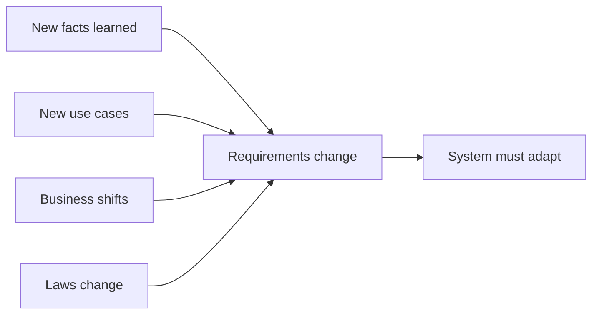
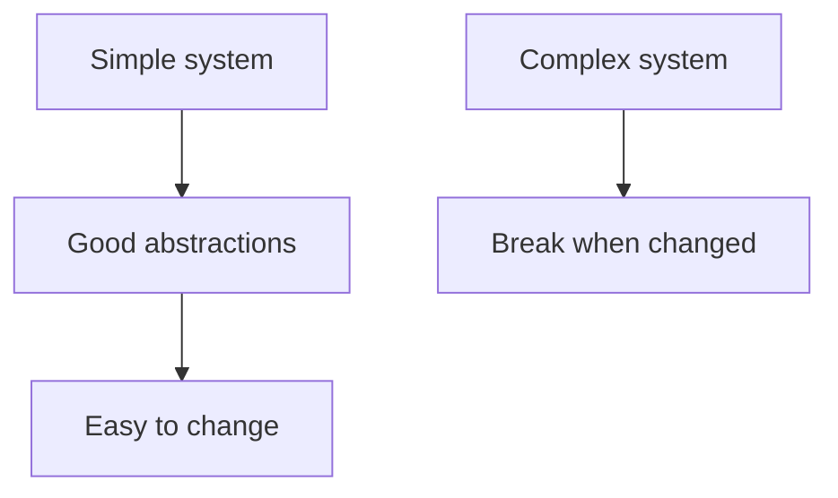

# Evolvability - Making Change Easy

## Recap — Where We Just Were
Last time, in [[Simplicity - Managing Complexity]], we saw that a system stays healthy when we fight off *accidental complexity* — the tangled mess that piles up over time and isn't part of the actual problem. We do that with good **abstractions** (an abstraction is a clean handle that hides messy details behind it). Now we cash in that work. Why do we bother keeping systems simple? Because tomorrow we will have to change them. This lesson is about that: making change easy. Kleppmann calls it **evolvability**.

## Level 1 — The Big Idea
Here is the uncomfortable truth: a system's requirements almost never stay fixed. Something always shifts. You learn a new fact. A use case nobody imagined shows up. The business changes its priorities. Users demand features. A platform you depend on gets replaced. A new law or regulation lands. And growth itself forces you to rebuild parts of the system.

So a system that is hard to change becomes a **liability** — a burden that costs you — no matter how fast or reliable it is today.

Think of a house. A house that performs great but where you can't move a single wall is worthless the day your family grows. A well-built house has some walls that *can* move. **Evolvability** is the "can move a wall" property for a data system. Kleppmann picked that special word on purpose: it means agility (the ability to change quickly and cheaply) at the level of a whole data system, not just one file of code.

## Level 2 — How It Actually Works
So how do you get evolvability? Two levels matter, and they are different.

**Local level (small scale).** The Agile world — a way of working that expects constant change — gives us technical tools like **TDD** (test-driven development: write the test first, then the code) and **refactoring** (reshaping code without changing what it does). These are great, but they usually operate on a few source files inside *one* application.

**System level (big scale).** DDIA cares about something bigger: how do you get that same agility across a whole **data system** — several applications and services glued together, each with different characteristics? That is harder, because now the tricky part sits *between* services, in the data models and contracts they share.

And here is the key link back to last lesson: **how easy a system is to change tracks its simplicity and the quality of its abstractions.** Simple, well-understood systems *bend*. Complex, tangled ones *break*. That is exactly why simplicity and evolvability are taught as a pair — simplicity is the precondition for evolvability.

## Level 3 — See It With Real Numbers
Let's make "change is hard at system scale" concrete with the book's own example: Twitter's home timeline.

Recall from [[Describing Load]] that Twitter had two designs. **Approach 1** merges tweets at read time. **Approach 2** does the work at write time: when you tweet, it fans your tweet out into every follower's precomputed timeline. Now imagine migrating from Approach 1 to Approach 2 while running.

Illustrative numbers:
- Users affected: **millions**, all live.
- Tweets flowing in per second: **thousands**, non-stop, during the switch.
- Lines of code renamed: that is *not* what this is. This is re-plumbing how data flows.

That last point is the lesson. This is **not** a "rename this function" refactor. It is a live rearchitecting of data flows under production load. TDD and a tidy codebase help, but they don't hand you this for free. This is the kind of change an evolvable system has to *permit* — and why system-level agility is its own hard problem.

## Level 4 — In the Real World and Common Traps
**Named example:** The Twitter timeline migration (Approach 1 to Approach 2) is the book's flagship case of a *system-scale refactoring* — reshaping data flow across services, not editing one file.

**People think evolvability is just a nicer word for good code.** Actually it is a distinct, first-class design goal, and Kleppmann deliberately names it — over alternatives like *extensibility*, *modifiability*, or *plasticity* — because it describes agility at the whole-system level, not clean code in one place.

**People think if their codebase has TDD and refactoring, the whole system is agile.** Actually local agility does not automatically give you system-level agility. The harder problem lives *between* services, in data models and contracts. (DDIA's Chapter 4 topic of schema evolution is the first deep dive into making change safe at that boundary.)

**People think building perfectly for today's requirements is the smart move.** Actually optimizing purely for today bakes in assumptions that tomorrow invalidates — the same trap as scaling an architecture built on wrong load assumptions. Since requirements always change, leaving room to change is the smart move.

## Check Yourself
**Memory hook:** *Simple bends, complex breaks — and requirements never stop changing.*

**Q:** What does evolvability mean, and why the special word?
**A:** It is the ability to change a system easily and cheaply — agility at the level of a whole data system, not just one file. Kleppmann chose the distinct word to mark it as a first-class goal.

**Q:** Why are simplicity and evolvability taught together?
**A:** Because ease of change tracks a system's simplicity and abstraction quality. Simple, well-abstracted systems bend; complex ones break. Simplicity is evolvability's precondition.

**Q:** Why is migrating Twitter's timeline design not just "refactoring"?
**A:** It re-plumbs how data flows across a live system serving millions of users, not a rename inside one codebase. It is a system-scale change that only an evolvable system permits.

## Connects To
- [[Simplicity - Managing Complexity]] — simplicity is evolvability's precondition.
- [[Operability - Making Life Easy for Operations]] — the third pillar of maintainability.
- [[Describing Load]] — the Twitter timeline migration referenced here.
- [[Ch01 - Reliable, Scalable, Maintainable Applications]] — this closes the Chapter 1 concepts.

## Coming Up Next
That wraps Chapter 1's ideas. Next up is [[Ch02 - Data Models and Query Languages]] — Chapter 2's concepts come next, where we look at *how* we shape and query the data itself.
