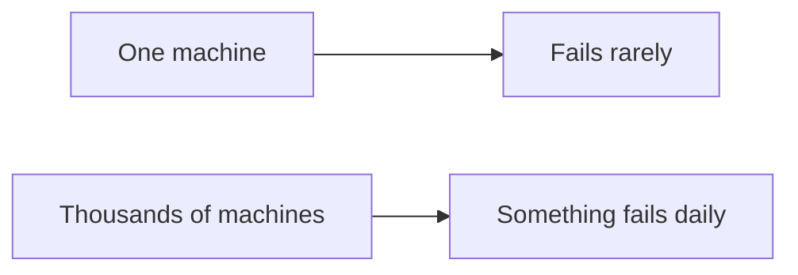
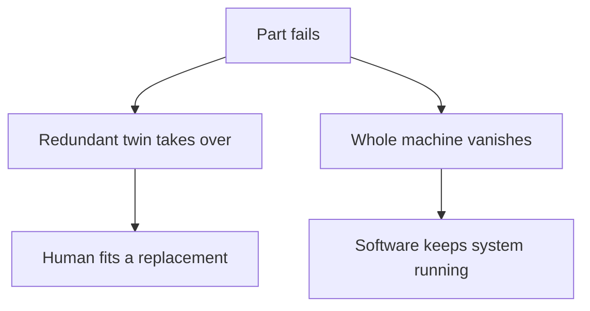

# Hardware Faults

## Recap — Where We Just Were
In [[Ch01 - Reliable, Scalable, Maintainable Applications]] we said a *reliable* system keeps working even when things go wrong. The first kind of "wrong" we'll meet is the physical stuff breaking — hardware faults.

## Level 1 — The Big Idea
A "hardware fault" is when a physical part of a computer breaks. A disk stops spinning. A stick of RAM (the computer's short-term memory) goes bad. The power grid blacks out. Someone trips over a cable and pulls it loose.

For one home computer, this is rare and shocking. But a big datacenter runs thousands of machines at once. At that size, something breaking isn't a surprise — it's *background noise*, happening all the time.

Here's the everyday version. One light bulb in your house almost never dies. But a stadium with 50,000 bulbs will have a few burning out every single night. Nothing is wrong with the stadium. That's just what large numbers do.

The good news: these breakages are mostly *random and independent*. One machine's disk dying tells you nothing about its neighbor. So we can plan for them.



## Level 2 — How It Actually Works
The classic defense is **redundancy** — keeping a spare so a twin can take over the moment one part dies.

The book names the standard toolkit:
- **RAID** for disks — many disks arranged so data survives if one dies.
- **Dual power supplies** — a second power unit inside the server.
- **Hot-swappable CPUs** — chips you can replace without turning the machine off.
- **Batteries and diesel generators** — backup power for the whole building when the grid fails.

When a part dies, its twin carries the load while a human fits a replacement. This doesn't stop failures. It just makes a *whole machine* dying rare enough that, plus quick backup restores, most apps were happy for years.

Then two things changed. First, apps grew to run on *many* machines, so more machines means more total failures. Second, cloud platforms like **AWS** deliberately kill virtual machines without warning — they trade the reliability of any single box for flexibility. So the modern answer is **software fault-tolerance**: build the system so it keeps running even when a *whole machine* vanishes.



## Level 3 — See It With Real Numbers
The book gives a mean time to failure (MTTF) of roughly **10 to 50 years** for a single hard disk. MTTF just means the average time before one dies.

That sounds safe for one disk. But now picture a cluster of **10,000 disks**. Watch what the scale does:

```python
disks = 10000
mttf_years = 10          # optimistic end of the 10-50 year range
years_per_day = 1 / 365

# how many disks die per day, on average
deaths_per_day = disks / (mttf_years * 365)
print(deaths_per_day)    # about 2.7
```

Even at the *safe* end of the range (50 years) you'd still expect a disk death every day or two. The book's headline: a 10,000-disk cluster should expect **about one disk dying every single day**.

So "10 to 50 years per disk" and "a death every day" are the *same fact* seen at two different scales. Multiply a rare event by ten thousand and it becomes routine.

## Level 4 — In the Real World and Common Traps
**Real example:** AWS is the book's go-to case where machine instances just *disappear* without notice. The cloud provider isn't broken — it's built that way, optimizing for elasticity over any one box staying alive. Your software has to survive it. (The 10,000-disk figure itself comes from failure studies of huge storage fleets, like Google's and Backblaze's published data.)

Some misconceptions to clear up:

- **People think** hardware redundancy protects your whole system. **Actually** it only protects a *machine*. It can't help when the platform itself takes your virtual machine away — there's no "twin" for that.
- **People think** a single strong server is fine if it has backups. **Actually** every OS update or reboot forces *planned downtime* on that one server. A system spread across many machines can patch one node at a time (a "rolling upgrade") and never go dark.
- **People think** redundancy makes failures impossible. **Actually** redundancy budgets assume failures are *independent*. Shared causes — one power feed, one hot rack — can knock out many parts at once and defeat the plan.

## Check Yourself
Memory hook: *rare per machine, routine at scale — so plan for it, don't be shocked by it.*

**Q:** Why does a 10,000-disk cluster lose a disk almost every day if each disk lasts 10–50 years?
**A:** Because you multiply a rare per-disk failure by ten thousand disks. At an MTTF of ~10 years, that's roughly 2–3 disk deaths per day.

**Q:** What's the difference between hardware redundancy and software fault-tolerance?
**A:** Redundancy keeps a spare *part* so a machine survives. Software fault-tolerance keeps the whole *system* running even when an entire machine disappears — which is what cloud platforms like AWS demand.

**Q:** Why do random, independent hardware faults get called "tractable"?
**A:** Because one machine failing tells you nothing about the next, you can plan capacity and spares around known odds — unlike correlated failures that strike many parts at once.

## Connects To
- [[Ch01 - Reliable, Scalable, Maintainable Applications]]
- [[Software Errors]]
- [[Human Errors]]
- [[How Important Is Reliability]]

## Coming Up Next
[[Software Errors]] — hardware faults are random and independent, but the next kind of fault is the opposite: bugs that hit every machine at once.
