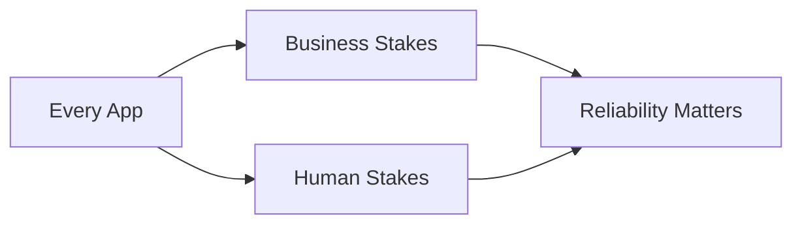
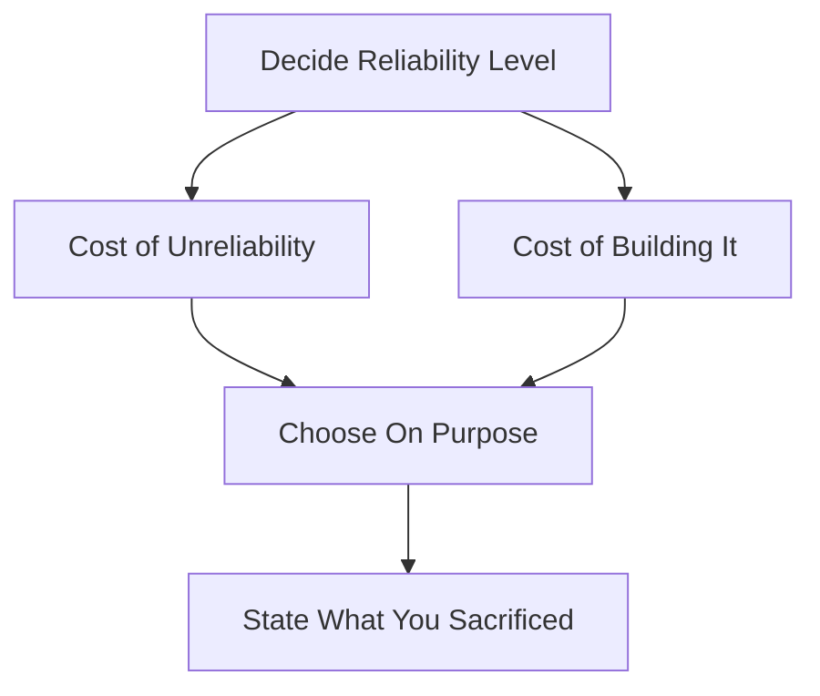

# How Important Is Reliability

## Recap — Where We Just Were
We just saw that most outages trace back to people, not machines — and that good systems are built to absorb those mistakes. But that raises a fair question: how hard should we even try? Building all those safety nets costs time and money. When is reliability worth paying for, and when is it okay to let some slip? That is exactly what this lesson is about.

## Level 1 — The Big Idea
It is tempting to think reliability is only for scary things — nuclear plants, air traffic control. This chapter pushes back hard: **ordinary apps matter too.**

Think of a bike helmet. A racing driver obviously needs a full crash cage. But you still wear a helmet to ride to school — the stakes are lower, not zero. Skipping it is a choice, and you should make that choice on purpose, not by forgetting.

Software is the same. A photo app is not "life or death," yet it holds things people can never replace. Reliability is not a fancy extra. It is a responsibility that comes with every app.

## Level 2 — How It Actually Works
The chapter frames reliability as a **balance between two costs**.

On one side is the **cost of being unreliable**. Bugs waste people's time. Wrong numbers in business software can create legal trouble — imagine reporting the wrong figures to a regulator. An online store that goes down loses sales that hour, and, worse, loses trust that takes far longer to rebuild.

On the other side is the **cost of building reliability**. Safety nets take engineering effort, and running extra backup machines costs money. So reliability is *not* an absolute — sometimes you genuinely can trade it down. A quick prototype for a market nobody has proven yet should be built fast and rough, not like a bank ledger. A service running on razor-thin margins may not be able to afford gold-plated fault tolerance ("fault tolerance" = staying up even when a part fails).

Here is the real rule. Cutting corners is fine engineering. **Cutting corners *without noticing* is not.** A good team can say out loud which reliability properties they gave up, and why.

## Level 3 — See It With Real Numbers
The note does not give exact dollar figures, so here is a labelled illustration to feel the shape of it.

Picture a small online store that makes about **$2,000 in sales every hour**.

- Outage for 3 hours -> roughly **$6,000 in lost sales**, gone directly.
- Plus a slower cost: some shoppers who hit the error page never come back. Say 200 of them, each worth $50 over a year -> **$10,000 in lost future business**.

Now the human side, which has *no* price tag at all. A parent stores every photo and video of their kids in your app. If the database silently corrupts that data ("corrupts" = quietly scrambles it), the loss is **irreplaceable** — and would that parent even know how to restore a backup? Some failures cannot be measured in money because what is lost cannot be bought back.

## Level 4 — In the Real World and Common Traps
**Named example — the family-photos app.** This is the chapter's emblem of trust in "noncritical" software. Nobody calls a photo app critical. Yet it may hold the only copy of a memory that can never be recreated. That is why "noncritical" is a dangerous label.

**People think:** Reliability is only for safety-critical systems like planes and power plants.
**Actually:** Ordinary business and consumer apps carry real stakes too — money, legal risk, and irreplaceable personal data.

**People think:** Cutting corners on reliability is always sloppy engineering.
**Actually:** Trading reliability down can be a perfectly valid choice — for a rough prototype, or a service on thin margins. The trade itself is fine.

**People think:** If we skip reliability work, we can just fix it if it ever breaks.
**Actually:** The danger is drifting into cut corners *unconsciously*. The problem is not the sacrifice — it is not knowing you made one.

## Check Yourself
**Memory hook:** *Cut corners on purpose, never by accident.*

**Q:** Is reliability only important for safety-critical systems?
**A:** No. Ordinary business and consumer apps carry real business and human stakes too.

**Q:** Name one good reason to deliberately trade reliability down.
**A:** A quick prototype for an unproven market, or a service on razor-thin margins that can't afford heavy fault tolerance.

**Q:** What separates acceptable corner-cutting from bad engineering?
**A:** Doing it consciously — being able to state which reliability properties you gave up and why — versus drifting into it without noticing.

## Connects To
- [[Human Errors]] — the defenses this obligation pays for
- [[Hardware Faults]] — the baseline fault class every app faces
- [[Approaches for Coping with Load]] — the parallel argument about premature scaling
- [[Ch01 - Reliable, Scalable, Maintainable Applications]] — the chapter this sits in

## Coming Up Next
We have settled *why* systems should keep working. Now we ask what happens when many more people show up at once — so we turn from reliability to scalability, starting with [[Describing Load]], which gives us the vocabulary to measure how much work a system is being asked to do.
