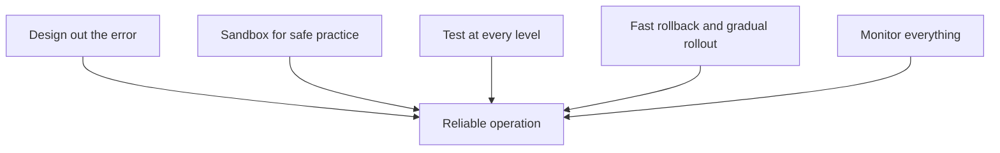

# Human Errors

## Recap — Where We Just Were

In [[Software Errors]] we looked at bugs — mistakes baked *into* the code before
it ever runs. But there's a sneakier source of trouble: the mistakes humans make
while *operating* a live system — changing a setting, running a command, pushing
an update. This note is about those, and how good systems survive them.

## Level 1 — The Big Idea

Imagine a spotless commercial kitchen. The equipment is top-notch and never
breaks. Yet most nights something still goes wrong — because a tired cook grabs
salt instead of sugar, or flips the wrong switch. The gear isn't the problem.
*People* are.

Data systems are the same. Humans design, build, and run every one of them, and
even careful, well-meaning humans are unreliable. So the honest question isn't
"how do we stop humans from making mistakes?" (we can't). It's: **how do you
build a reliable system out of unreliable people?**

The trick is to stop aiming for "never make a mistake" and aim for "make
mistakes small and easy to undo."

## Level 2 — How It Actually Works

Good systems don't rely on one safeguard. They stack several, so a mistake that
slips past one layer gets caught by the next.

1. **Design out the error.** Build interfaces where the right action is easy and
   the wrong one is awkward. But don't overdo it — if the guardrails block real
   work, people invent workarounds, and the workaround is usually *less* safe
   than what you were trying to prevent.
2. **Separate mistake-making from damage-doing.** Give people a *sandbox* — a
   full-featured practice copy loaded with realistic data — where they can
   experiment without touching real users. (A sandbox is a safe play-area
   separate from the live system.)
3. **Test at every level.** From tiny unit tests up to whole-system tests.
   Automated tests especially earn their keep on the rare corner cases that
   almost never show up in normal use.
4. **Make recovery fast and cheap.** Be able to *roll back* a bad configuration
   quickly (undo it and return to the last good state), roll out new code
   *gradually* so a bug hits only a small slice of users, and keep tools to
   recompute data when an earlier calculation turns out wrong.
5. **Instrument everything.** Watch performance and error rates constantly. Other
   fields call this *telemetry* — the same discipline that tracks a rocket after
   launch. Good monitoring gives early warning and speeds diagnosis when
   something does break.
6. **Manage and train people well** — the book admits this matters a lot, even
   though it's beyond its scope.

## Level 3 — See It With Real Numbers

Here's the fact that should reshape how you think. A study of large internet
services asked what actually causes their outages (times the service goes down).
The number-one cause was **operator configuration errors** — humans setting
something up wrong. By contrast, hardware faults (a dead server, a broken network
link) were behind only **10 to 25 percent** of outages.

Let that sink in: the machines are more reliable than the people who run them.

Now picture the fast-recovery ideas in action. An engineer pushes a bad config
change at 2:00 PM:

- 2:00 — the change goes out, but only to a *canary* — a tiny 1% slice of users.
- 2:01 — monitoring shows the error rate on that slice spiking.
- 2:03 — the engineer hits rollback; the config snaps back to the last good
  version.
- 2:04 — errors return to normal.

Only 1% of users saw anything, for about four minutes. Same mistake without
canary rollout and fast rollback could have taken down *everyone* for an hour.
The mistake didn't change — the blast radius did.

## Level 4 — In the Real World and Common Traps

The internet-services outage study is the anchor example: config errors #1,
hardware only 10–25%. And the model for good monitoring comes from rocketry —
engineers track a rocket's telemetry after launch precisely because they can't
reach in and fix it mid-flight, so early warning is everything. Production
systems borrow that same mindset.

A few things people get wrong:

- **People think** the biggest threat to reliability is hardware failing.
  **Actually** operator mistakes — especially misconfiguration — cause far more
  outages than hardware does.
- **People think** the goal is to design systems so nobody can *ever* make a
  mistake. **Actually** locking things down too hard backfires: people route
  around the guardrails, and the workaround is usually more dangerous. The real
  goal is to err *small* and recover *fast*.
- **People think** a sandbox is helpful just by existing. **Actually** it only
  helps if it's genuinely representative — full-featured and filled with real
  data. A fake, half-built sandbox teaches false confidence.

## Check Yourself

**Memory hook:** *People break more than hardware — so err small and recover
fast.*

**Q:** According to the outage study, what causes more outages — operator config
errors or hardware faults?
**A:** Operator configuration errors are the number-one cause; hardware faults
account for only about 10–25%.

**Q:** Why can making an interface *too* restrictive actually hurt reliability?
**A:** People work around guardrails that block legitimate work, and the
workaround is usually less safe than what it replaced.

**Q:** What two recovery tools shrink the damage from a bad change?
**A:** Fast rollback (quickly undo the change) and gradual/canary rollout (push
to a small slice of users first, so a bug hits only a few).

## Connects To

- [[Software Errors]] — bugs humans write, versus mistakes humans make operating.
- [[Operability - Making Life Easy for Operations]] — the maintainability side of
  designing around fallible humans.
- [[Hardware Faults]] — the failure category that, surprisingly, causes fewer
  outages than people do.
- [[Ch01 - Reliable, Scalable, Maintainable Applications]] — where all these
  fault types fit together.

## Coming Up Next

[[How Important Is Reliability]] — now that we've seen humans are the top fault
source, we'll ask why this whole reliability discipline is worth the effort even
for ordinary, everyday apps.
