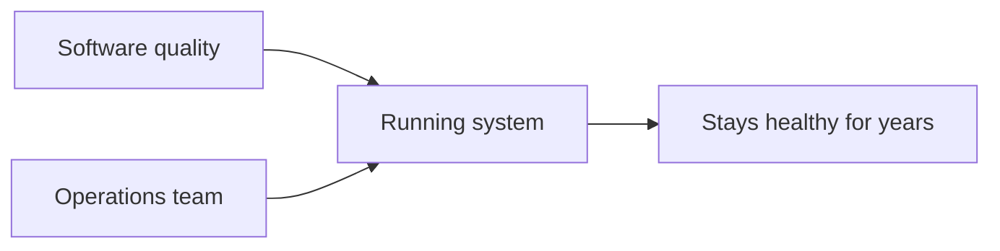
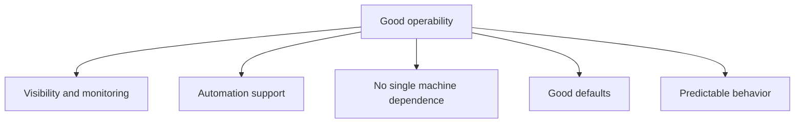

# Operability - Making Life Easy for Operations

## Recap — Where We Just Were   (bridge from [[Approaches for Coping with Load]])
In [[Approaches for Coping with Load]] we asked how a system survives *more* traffic — scaling up, scaling out, and reshaping the architecture as load grows. But building a system is only day one. After that, someone has to *keep it running* for years. That daily care is called **operations**. This lesson is about making their job easy. That quality is called **operability**.

## Level 1 — The Big Idea   (what operations/ops is + analogy)
**Operations** (or "ops") is the team that keeps a live system healthy — watching it, patching it, and fixing it when it breaks.

There's a famous observation from an engineer named Jay Kreps: a great ops team can often work around bad or half-finished software. But even great software falls apart under bad operations. So how easy a system is to *operate* really matters.

Analogy: think of a system as a car. **Operability** is how easy the car is to service. A good car has a dashboard (you can see the fuel and temperature), warning lights (it tells you before something fails), and standard parts (any mechanic can fix it). A badly designed car hides everything under a sealed hood — it might drive fine today, but nobody can keep it alive. Operability is the "easy to service" quality, built into the system on purpose.

Automation helps a lot. But note: humans still have to *build* the automation and check that it keeps working. So operations stays a human job. Design either helps those humans or fights them.

## Level 2 — How It Actually Works   (what good operability provides)
A good ops team does a lot: they **monitor health** and restore service fast, trace *why* things fail or slow down, keep software patched (including security), spot risky changes before they cause damage, plan capacity ahead of time, run deployments and migrations, and keep knowledge about the system alive even when people leave.

The system's side of the deal is **good operability** — making those routine tasks easy. A well-behaved data system should:

- Expose its internals through good **monitoring**, so behavior is visible (gloss: monitoring means measuring what the system is doing right now).
- Support **automation** and plug into standard tools.
- Avoid depending on any single machine, so one can be taken offline for maintenance while the rest keeps serving.
- Ship good docs and a **predictable operational model** — "if I do X, then Y happens."
- Give **sane defaults**, but let admins override them.
- Self-heal where sensible, yet still allow manual control.
- **Behave predictably**, with as few surprises as possible.

## Level 3 — See It With Real Numbers   (a concrete scenario)
Two systems have the same bug: a background job silently stops running. What differs is the monitoring.

**System A — no visibility.** Nobody notices until users complain that data looks stale.
- Time to detect: about 6 hours.
- Time to fix once known: 20 minutes.
- Total outage impact: ~6 hours 20 minutes.

**System B — good monitoring.** A dashboard tracks "minutes since the job last ran." An alert fires when it crosses 10 minutes.
- Time to detect: ~10 minutes.
- Time to fix once known: 20 minutes.
- Total outage impact: ~30 minutes.

Same bug. The fix took the same 20 minutes both times. The huge difference — 6+ hours versus 30 minutes — came entirely from **time to detect**. Good monitoring didn't prevent the bug. It made the system *tell on itself* early, which is most of the win. (Numbers are illustrative, but the shape is real.)

## Level 4 — In the Real World and Common Traps   (named example + misconceptions)
Named example: **James Hamilton's playbook for internet-scale services** (sometimes tied to the LISA framework). It lists the ops duties above and argues that operability must be *designed in*, not bolted on. This is where DDIA's operability checklist comes from.

Common traps:

- **People think** automation removes the need for humans. **Actually** humans still build and verify the automation, and must be able to grab manual control when self-healing does the wrong thing. Automation and control both have to exist.
- **People think** locking everything down keeps a system safe. **Actually** good defaults help most users, but if experts can't override them, the system becomes frustrating and people fight it. Defaults should guide, not imprison.
- **People think** losing the one engineer who understood the system is just an HR problem. **Actually** it's an operability failure. A system only one departed person could run is a design flaw — knowledge should live in docs and predictable behavior, not one head.

## Check Yourself   (memory hook + 3 Q/A)
**Memory hook:** *A good system tells on itself.* Visibility, sane defaults, predictable behavior — all so ops can see trouble early and act.

**Q:** Jay Kreps' observation contrasts two things — what wins in the long run, good software or good operations?
**A:** Good operations can rescue flawed software, but good software can't survive bad operations. So operability matters a lot.

**Q:** In the Level 3 scenario, why was System B's outage so much shorter even though the fix took the same time?
**A:** Its monitoring cut the *time to detect* from ~6 hours to ~10 minutes. Detecting early was the main win, not fixing faster.

**Q:** Why should a system avoid depending on any single machine?
**A:** So one machine can be taken down for maintenance while the rest keeps serving — enabling zero-downtime upkeep.

## Connects To
- [[Human Errors]] — monitoring and quick rollback serve both reliability and operability.
- [[Hardware Faults]] — not depending on one machine enables zero-downtime maintenance.
- [[Approaches for Coping with Load]] — scaling is day one; operating the system is every day after.
- [[Ch01 - Reliable, Scalable, Maintainable Applications]] — operability is one pillar of maintainability.

## Coming Up Next
[[Simplicity - Managing Complexity]] — because a system that's simple to understand is far easier to operate, we look next at taming complexity.
