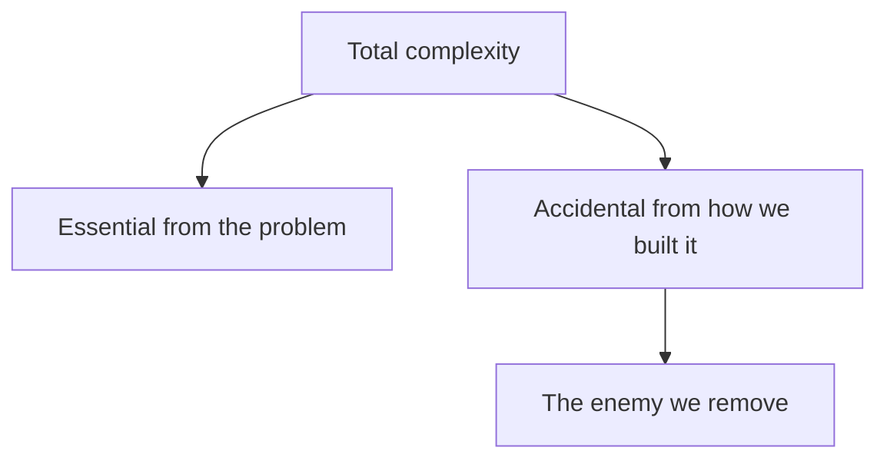

# Simplicity - Managing Complexity

## Recap — Where We Just Were   (bridge from [[Operability - Making Life Easy for Operations]])

Last time we looked at **operability** — making the humans who run a system have an easy life. A big part of that was making the system *understandable*, so operators can see what it is doing.

Now we go one level deeper. If understandability helps operators, why is it so hard to build understandable software in the first place? The answer is **complexity** — and this note is about where complexity comes from and how to fight it.

## Level 1 — The Big Idea   (accidental vs essential complexity + analogy + ONE mermaid diagram)

Small software projects can be delightfully clear. But as they grow, they tend to rot into what Foote and Yoder called a **big ball of mud** — a tangled mess where every change is slow and scary.

Here is the key split. Some complexity is **essential**: it comes from the problem itself, the thing your users actually need done. Some complexity is **accidental**: it comes from *how you built it*, not from the problem. (This split is from a paper called "Out of the Tar Pit" by Moseley and Marks.)

Analogy: giving a friend directions. The essential part is "go to the library." The accidental part is a knot of "turn left at the tree that used to have a swing, unless it's Tuesday..." The destination is simple. The mess is something you added.

Accidental complexity is the enemy. It slows everyone down and *breeds bugs* — when nobody can fully reason about the system, hidden assumptions slip past review.

## Level 2 — How It Actually Works   (symptoms of complexity from the note; abstraction as the antidote + ONE mermaid diagram)

First, how do you *spot* accidental complexity? By its symptoms:

- an **exploded state space** (too many possible situations to track),
- **tightly coupled modules** (change one, break another),
- **tangled dependencies**,
- **inconsistent naming** for the same thing,
- **performance hacks**,
- **special cases** patched in to paper over problems elsewhere.

Important: simplifying does **not** mean deleting features. It means peeling off the accidental layer while keeping the essential one.

The best tool for this is **abstraction** — hiding messy implementation detail behind a clean, understandable façade (a simple front face you interact with instead of the mess behind it). A good abstraction pays off twice: you reuse it instead of rebuilding it, and any quality fix to the shared piece lifts everything built on top.

Two classic examples. A high-level programming language hides machine code and CPU registers — you still *use* them, you just never think about them. **SQL** hides on-disk data structures, other clients accessing data at the same time, and crash recovery, behind one clean query model.

## Level 3 — See It With Real Numbers   (a concrete before/after scenario)

Let's make "special cases" concrete with an illustrative example.

Suppose a program formats dates, and every new country got patched in by hand:

- **Before (no good abstraction):** 40 countries, each with its own hand-written `if` block. That is roughly 40 special cases, maybe 400 lines of tangled code. Add country 41? Copy, paste, tweak, pray.

Now someone builds one **abstraction**: a single date-formatter that reads a small rules table.

- **After (one abstraction):** 1 formatter, about 60 lines, plus a table with 40 short rows. Adding country 41 means adding *one row* — not a new code branch.

Same feature. The essential complexity (dates really are different across countries) never left. But the **accidental** complexity — 40 branches to reason about — collapsed into one path. Fewer places to hide bugs.

These numbers are illustrative, but the shape is real: good abstractions turn many special cases into one path plus data.

## Level 4 — In the Real World and Common Traps   (named example + misconceptions)

**Named example:** SQL is the star. Millions of programs share this one abstraction, so a speed or safety improvement inside a database engine quietly benefits all of them at once. That is abstraction paying off twice.

Now the traps:

- **People think simplicity means fewer features.** Actually it means less *accidental* complexity. You can keep every feature and still simplify — you're removing tangled implementation, not capability.

- **People think a façade automatically reduces complexity.** Actually abstractions can *leak or mislead*. If your façade hides the *wrong* details, it creates brand-new accidental complexity instead of removing it. Finding good abstractions is genuinely hard — in distributed systems it's still an open craft.

- **People think "simple" is the same as "easy" or "small."** Actually simple implementation and a simple user interface are *different targets*. A system can be simple inside while presenting a rich interface outside, or vice versa. Don't confuse the two.

## Check Yourself   (memory hook + 3 Q/A)

**Memory hook:** *Essential complexity is the mountain. Accidental complexity is the mud you tracked in. Abstraction is the mop.*

**Q:** What is the difference between essential and accidental complexity?
**A:** Essential comes from the problem the users actually need solved. Accidental comes from how you built it, not from the problem — and it's the part worth removing.

**Q:** Does simplifying mean removing features?
**A:** No. It means stripping the accidental layer while keeping the essential one. Features can stay.

**Q:** Why can an abstraction sometimes make things worse?
**A:** If it hides the wrong details or leaks, it adds new accidental complexity instead of removing it. Good abstractions are hard to find.

## Connects To

- [[Operability - Making Life Easy for Operations]] — understandable systems are easier to run
- [[Evolvability - Making Change Easy]] — simple systems are the easiest to change
- [[Ch02 - Data Models and Query Languages]] — develops SQL, the star abstraction
- [[Ch01 - Reliable, Scalable, Maintainable Applications]] — the chapter this lives in

## Coming Up Next

Next is [[Evolvability - Making Change Easy]] — because once a system is simple, the real payoff is that it becomes far easier to change as your needs evolve.
