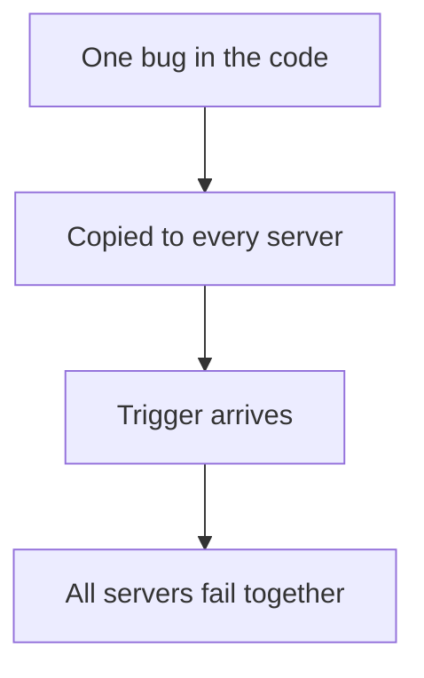
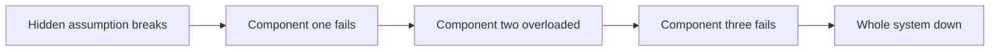

# Software Errors

## Recap — Where We Just Were
In [[Hardware Faults]] we saw disks, RAM, and power supplies fail on their own schedules. A disk dying in one server tells you almost nothing about the disk next to it. Because those failures are *independent* (unrelated to each other), you can cover them with redundancy — keep spare copies, and it is very unlikely all of them break at the same moment. Now we flip to a scarier kind of fault: bugs in the software itself. These do not stay politely independent, and that changes everything.

## Level 1 — The Big Idea
Imagine a factory that stamps out thousands of identical toy robots. Each robot has the same tiny wiring flaw. As long as nobody presses the red button, they all work fine. But the moment someone presses it, *every single robot* jams — all at once — because they all share the exact same flaw.

That is a **systematic fault**: a fault built into the design, so it is present in every copy. Software is like those robots. The same code ships to every server (every "node"). One bad assumption sits quietly inside all of them, waiting. When the trigger finally arrives, they all break together.



## Level 2 — How It Actually Works
Here is the key contrast. Hardware faults are **uncorrelated** — one machine's bad luck is not linked to another's. Software faults are **correlated** ("correlated" means linked, they move together) because you run the *same code everywhere*. There is only one bug, but it lives in all copies simultaneously. So when it fires, it fires everywhere.

The usual root cause is a **hidden assumption**. The software quietly assumes something about its world that is true almost always — until one day it is not. Because the assumption held for years, the bug lay **dormant** (asleep, never triggered, never tested) the whole time. Then the unusual condition finally arrives, and it arrives for every node at once.

The book names the common shapes this fault takes:
- A bug that crashes every server given one particular bad input.
- A **runaway process** that eats a shared resource — CPU, memory, disk space, or network bandwidth — starving everything else.
- A service you depend on that slows down, stops replying, or starts returning corrupted answers.
- **Cascading failures**, where one small fault trips a fault in the next component, which trips more, and the damage spreads.



## Level 3 — See It With Real Numbers
The book's flagship example is the **leap second** bug. Occasionally the world's official clocks add one extra second to keep in step with Earth's rotation. On **June 30, 2012**, that extra second triggered a hidden bug in the Linux kernel (the core of the operating system): on many machines the kernel got stuck spinning at full CPU and effectively hung — all at the same instant. The exact fault was deep in the kernel's timekeeping code; the *shape* is what matters. The software carried a dormant assumption that time would always tick forward in the ordinary way, and the rare leap second broke that assumption everywhere at once.

A tiny **illustrative** timeline of how a dormant bug bites (dates simplified):

```
earlier ......... timekeeping code ships with a hidden flaw
for a long time . runs fine, the flaw is never triggered (dormant)
2012-06-30 ...... a leap second arrives, the rare trigger fires
2012-06-30 ...... every affected server hangs at the SAME moment
```

Notice what redundancy does here: nothing. If you had ten identical servers, all ten hit the leap second, all ten hang. Extra copies do not help when every copy carries the same flaw.

## Level 4 — In the Real World and Common Traps
A real cascading example the book points to is the **2011 Amazon EC2/RDS US-East** disruption, where a fault in one part of the system pushed load onto others and the trouble spread outward instead of staying put.

- **People think:** more replicas make you safe from any failure. **Actually:** replicas protect you from *hardware* faults, not software bugs — every replica runs the same buggy code, so they all fail together.
- **People think:** if the code has worked for years, it must be correct. **Actually:** it may just be that the trigger never arrived. A dormant bug looks exactly like working code until the unusual condition shows up.
- **People think:** there is one clean fix for software faults. **Actually:** there is no single fix. You stack small habits — question your assumptions, test hard, isolate processes, let them crash and restart cleanly, and monitor production. One strong move: if a system promises a guarantee (say, a message queue promising messages-in equals messages-out), have it constantly **audit** that promise while running and alert on any mismatch.

## Check Yourself
**Memory hook:** *Same code everywhere means same bug everywhere.* Copies do not save you from a flaw they all share.

**Q:** Why are software faults more dangerous than hardware faults across many machines?
**A:** They are correlated — the same bug lives in every node, so one trigger takes them all down at once, unlike independent hardware failures.

**Q:** What is a "dormant" bug, and why does it feel like a surprise?
**A:** It is a bug that never fires because its trigger condition has not happened yet. The code looks correct for years, then an unusual condition arrives and it breaks everywhere.

**Q:** Why is redundancy useless against a systematic software fault?
**A:** Every replica runs the identical buggy code, so adding copies just adds more machines that carry — and hit — the same flaw.

## Connects To
- [[Hardware Faults]] — the uncorrelated fault class this one contrasts with.
- [[Human Errors]] — the third fault class: the people operating the system.
- [[How Important Is Reliability]] — why guarding against these faults is worth the effort.
- [[Ch01 - Reliable, Scalable, Maintainable Applications]] — the chapter this sits inside.

## Coming Up Next
Next up is [[Human Errors]] — because once you have wrestled machines and code, the biggest remaining source of failure is the humans who configure and operate the system.
